# 🦝 Banditboard

<p align="right"><b>English</b> · <a href="README.pt-BR.md">Português</a></p>

**Keep your Claude Code limits in sight: on an old Android phone, your iPhone and Apple Watch, or a widget on Windows and Mac.**

<p align="center">
  
</p>

<p align="center">
  <a href="https://banditboard.pages.dev/video/banditboard-en.mp4">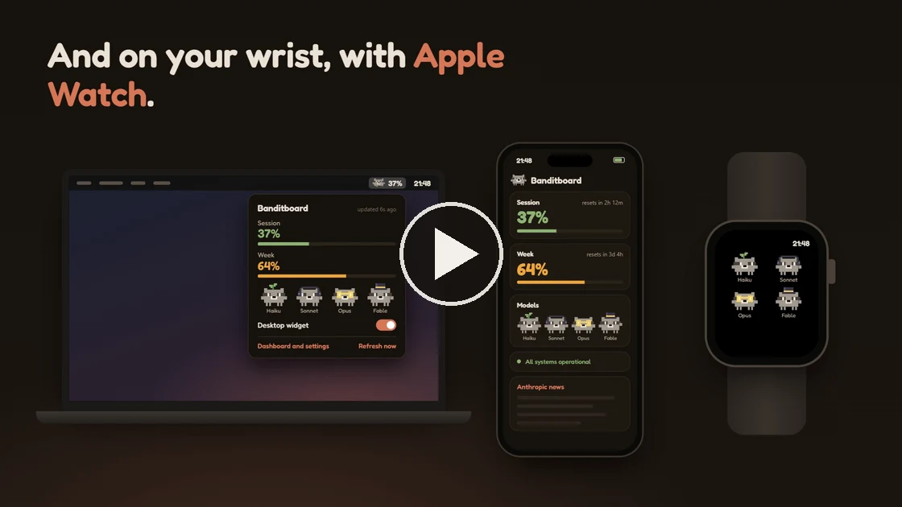</a><br>
  <sub>▶️ <a href="https://banditboard.pages.dev/video/banditboard-en.mp4">Watch the video</a></sub>
</p>

<p align="center">
  <a href="../../releases/latest"></a>
  <a href="../../releases"></a>
  <a href="LICENSE"></a>
  <a href="../../commits/main"></a>
  <a href="../../stargazers"></a>
  <br>
  
  
  
  
  
</p>

<p align="center"><b><a href="#-get-started">Get started</a></b> · <a href="https://banditboard.pages.dev/en/">Website</a> · <a href="https://banditboard.pages.dev/conectar/">Connect from anywhere</a> · <a href="../../releases">All releases</a></p>

## What is Banditboard?

Banditboard is an always-on display for your Claude usage. It shows how much of the 5-hour session and of the week you have
used, when each one resets and whether any model has an open incident. Each model is Racco, a pixel-art raccoon who sleeps,
sweats, bursts at 100% and dances when music plays.

It started on that old Android phone sitting in a drawer, and now it runs wherever you look: an iPhone with Home Screen
widgets and StandBy, an Apple Watch with complications, a small always-on-top widget on Windows, and Racco with your session
percentage in the Mac menu bar. Use one or all of them at once: the same Claude Code hook feeds every device.

### Why Banditboard?

You usually only check your limits when you remember to run `/usage`, and the session tends to run out right in the middle of
a task. Banditboard keeps the numbers in sight all the time, on a phone next to your monitor, on your wrist or in a corner of
the screen, and warns you at 80%, 90% and 100%. No terminal to keep open, no tab to refresh. The numbers come from Claude Code
itself, so there is no token or login to hand over.

## ✨ Features

- 📊 **Usage at a glance**: 5-hour session and 7-day week, with a countdown and the local time each one resets
- 🦝 **Racco, the raccoon**: one per model (Haiku, Sonnet, Opus and Fable). They blink, wave, sleep when the session is empty, sweat from 85%, turn red from 90% and burst at 100%. Skins, tints and the classic Racco are in the settings
- 🔔 **Limit alerts**: a notification at 80%, 90% and 100% of the session or the week, and another when it resets. On Android they arrive even with the app closed
- 📱 **iPhone**: dashboard, Home Screen and Lock Screen widgets, StandBy on the charger, and alerts
- ⌚ **Apple Watch**: an app with session, week and models, plus complications for your watch face. After pairing through the iPhone, the watch fetches usage by itself
- 🍎 **Mac menu bar**: Racco and the session percentage next to the clock, a small panel on click and an optional desktop widget
- 🪟 **Windows widget**: full, compact or just Racco in a corner of the screen, always on top, with alerts from Windows itself
- 🌐 **Connect from anywhere**: pair on [banditboard.pages.dev/conectar](https://banditboard.pages.dev/conectar/) and usage reaches your phone outside your home network, encrypted end to end
- 📷 **QR code pairing**: scan a code from the website or from the Windows or Mac dashboard, no PIN needed
- 🔌 **No token on the phone**: the numbers come from Claude Code's own `/usage` on your computer
- 🎵 **Music mode**: whatever plays on the phone (Spotify, YouTube Music or any player), with cover, controls and volume, while the raccoons dance on every screen
- 📈 **7-day history**: one sample every 30 minutes
- 🖥️ **Web dashboard**: the Android app's view in your PC browser, on the local network, with PIN login
- 🚦 **Status and news**: open incidents from status.claude.com and the latest Anthropic news
- 🌙 **AMOLED black**: plus a few pixels of shift per minute against burn-in
- 🌍 **English and Portuguese**: follows the device's language, or pick one in the settings
- 📱 **Portrait and landscape**: a layout for each on Android, and accessibility zoom from 90% to 150%

## 🚀 Get started

| Platform | File | |
|---|---|---|
| Android 8.0 or newer | `Banditboard-<version>.apk` | [Download](../../releases/latest) |
| iPhone (iOS 17 or newer) and Apple Watch (watchOS 10 or newer), beta | `Banditboard-<version>-iphone.ipa` | [Download](../../releases/latest) |
| Windows 10 or newer, installer | `Banditboard-<version>.msi` | [Download](../../releases/latest) |
| Windows 10 or newer, portable | `Banditboard-<version>-windows.zip` | [Download](../../releases/latest) |
| macOS 11 or newer, Intel or Apple silicon | `Banditboard-<version>.dmg` | [Download](../../releases/latest) |

### On your computer

The Windows and Mac apps are complete monitors on their own, and they also connect Claude Code for your other devices.

**Windows**

1. Install the MSI (no admin needed). Prefer not to install? Unzip the ZIP anywhere and run `Banditboard.exe`.
2. Click "Connect Claude Code" on the widget. Usage shows up right away. If it can't connect, the widget says why and "What to do" opens the dashboard with the next step.
3. Keep using Claude Code. After a response, the widget updates. To fetch it on the spot, use "Refresh now" on the dashboard or in the tray menu.

**Mac**

1. Open the DMG and drag Banditboard to Applications.
2. The app is not notarized by Apple yet, so the first time macOS says it can't verify it. Go to System Settings → Privacy & Security and click "Open Anyway". On Apple silicon, macOS may offer to install Rosetta first.
3. Racco shows up in the menu bar. Click it and then "Connect Claude Code". Usage shows up right away, and the menu bar starts showing your session percentage.

### On the phone and on the watch

Pick one of three ways to get the numbers there:

- **From anywhere (Android and iPhone).** Open [banditboard.pages.dev/conectar](https://banditboard.pages.dev/conectar/) on any browser. Scan the QR code with the phone, then copy the command for Windows or Mac and run it on the computer where Claude Code runs. Usage goes through the Banditboard server encrypted end to end, so the phone doesn't need to be on your Wi-Fi. On Android, alerts arrive even with the app closed.
- **QR code on your home network (Android and iPhone).** On the Windows or Mac dashboard, turn on "Share usage with the iPhone on your home network" and scan the code. It works for Android too.
- **PIN on your home network (Android).** Open the address shown on the phone in your PC browser, create a PIN, click "Copy" on the "Claude Code on your PC" card and paste the command into PowerShell.

On Android, the scanner is under "Scan QR code". On iPhone, point the Camera at the code and tap the banner.

**Installing on iPhone (beta).** Banditboard is not on the App Store yet. The IPA in the release is unsigned: you install it
with your own Apple ID using [Sideloadly](https://sideloadly.io/) (Windows or Mac) or [AltStore](https://altstore.io/). With a
free Apple ID, apps sideloaded this way stop opening after 7 days, so refresh or reinstall it once a week; your pairing stays.
Then add the widgets: touch and hold the Home Screen → Edit → Add Widget → Banditboard. For StandBy, charge the iPhone on its
side while locked and add Banditboard to the widget stacks.

**Apple Watch.** The watch app comes inside the iPhone app. If it doesn't install by itself, open the Watch app on the iPhone
and tap "Install" next to Banditboard. Open Banditboard on the iPhone once: it hands the pairing to the watch, and from then on
the watch fetches usage by itself. To add a complication, touch and hold the watch face → Edit → Complications → Banditboard.

### Using several devices

Connect each one once. The hook keeps a list of destinations in `~/.claude/clawdboard-targets.json` and sends to all of them,
so connecting a new device never disconnects the others.

> A Claude Code hook runs `/usage` after responses, at most every 2 minutes, without using any tokens. Usage from
> claude.ai or other devices also shows up, because `/usage` reports the whole plan. The hook runs on Windows (PowerShell)
> and macOS (sh); [Linux is on the way](../../issues/1).

## 🔐 Security

- No device ever holds a Claude token or calls the Anthropic API. Claude Code on your computer reads your limits with `/usage` and a small script forwards them. The script never reads Claude Code's credentials.
- The script sends only the percentages, their reset times and the model family of each session active in the last 10 minutes ("opus", "sonnet"...), nothing from your conversations, files or session IDs.
- Each push carries a 128-bit pairing key. The receiving app checks it against a SHA-256 hash, and "Create new key" invalidates the old command at once.
- **Connecting from anywhere.** The /conectar page creates the keys in your browser: a box ID, a write key, a read key and a 256-bit master key. The Banditboard server (a Cloudflare Worker) only receives SHA-256 hashes of the write and read keys. The script encrypts every push with AES-256-CBC and HMAC-SHA256, with keys derived from the master key, which only the QR code and the command carry. The server keeps the latest encrypted push, its time and a coarse level (0, 80, 90 or 100 for the session and the week) to know when to wake the Android app, and it can't read the numbers. Android alerts go through Firebase Cloud Messaging as the same ciphertext. A box that receives nothing for 45 days is deleted.
- **QR code on your home network.** Sharing is off until you turn it on in the Windows or Mac dashboard. Then the app answers read-only on your home network (ports 47830 to 47839), and only to requests that carry the key from the QR code.
- On Android, the pairing key is encrypted with AES-256-GCM using a key derived from your PIN (PBKDF2, 150,000 iterations) and wrapped by an Android Keystore key. The PIN is never stored, and 10 wrong PINs in a row wipe the pairing key, the history and the settings. A QR code pairing is kept in the app's private storage and needs no PIN.
- On iPhone and Apple Watch, the pairing lives in the Keychain, shared only with Banditboard's own widgets.
- The Android web dashboard only runs on the local network, asks for the same PIN and only answers when the Host is an IP address, `localhost` or a `.local` name, which blocks DNS rebinding. Logging in on the dashboard also unlocks the phone screen.
- The installer keeps a backup of your Claude Code settings in `settings.json.antes-do-clawdboard`, adds two hooks (`Stop` and `SessionStart`) and does not touch your status line.
- The Windows and Mac apps receive pushes only on `127.0.0.1`, and they still check the pairing key on every push.
- Music mode needs notification access because Android only shows the active player to apps with that access. Banditboard uses it to see and control the player; it does not read your notifications.

**Read the scripts before you run them.** Everything that runs on your computer is short and auditable:
[`install.ps1`](app/src/main/assets/pc/install.ps1) and [`install.sh`](app/src/main/assets/pc/install.sh) (write the hook and
edit `settings.json`), [`usage.ps1`](app/src/main/assets/pc/usage.ps1) and [`usage.sh`](app/src/main/assets/pc/usage.sh) (the
hook itself) and [`connect.ps1`](desktop/src/main/resources/connect.ps1) (the wrapper the Windows app uses to run the
installer). The server is [`worker/src/index.js`](worker/src/index.js).

**Check the download.** Every release lists the SHA-256 of each file. Compare it with yours:

```powershell
Get-FileHash .\Banditboard-1.14.0.msi -Algorithm SHA256
```

```sh
shasum -a 256 Banditboard-1.14.0.dmg
```

## 📱 Screenshots

### Android

| | | |
|---|---|---|
|  |  |  |
| Dashboard | Mascots | 7-day history |

<p>
  
  
</p>

The desk clock in portrait, and the limit alerts. The phone keeps a quiet notification while it listens for your PC, so the
alerts arrive even with the app closed. You can turn them off in Settings → Screen.

### iPhone

<p>
  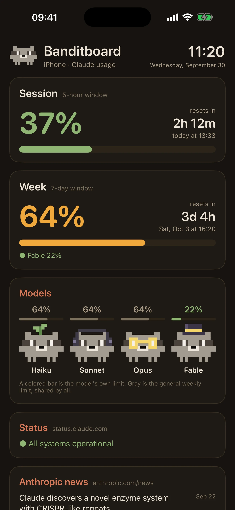
  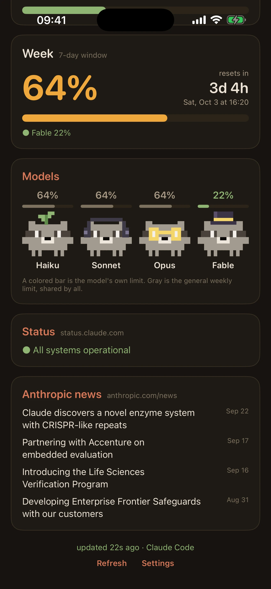
  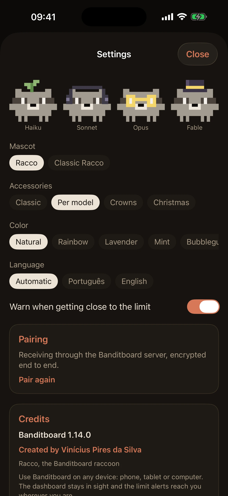
</p>

<p>
  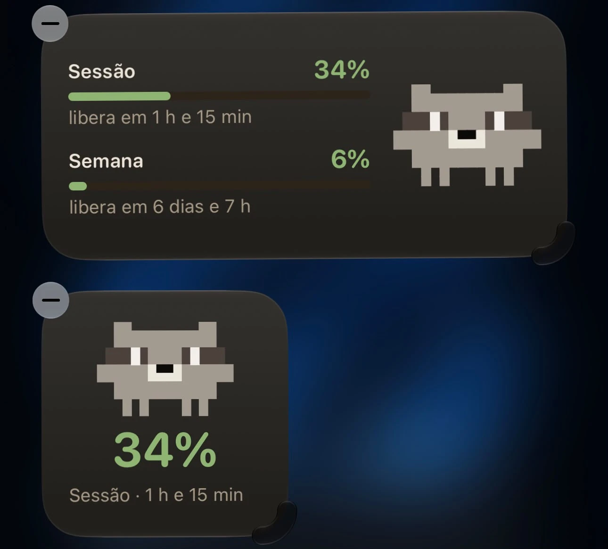
  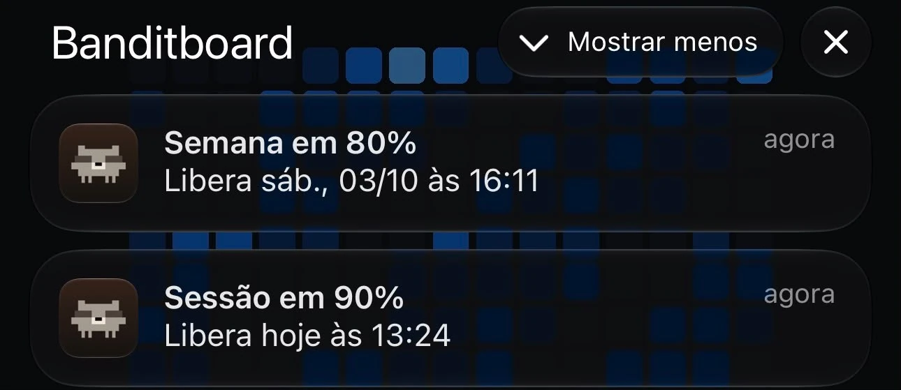
</p>

The dashboard, the settings, the Home Screen widgets and the alerts (the last two shown in Portuguese). The widgets also come in
Lock Screen sizes and show up in StandBy. iOS decides how often apps refresh in the background, so on iPhone an alert can arrive
a few minutes late.

### Apple Watch

<p>
  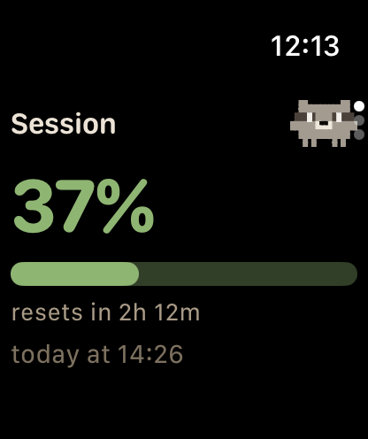
  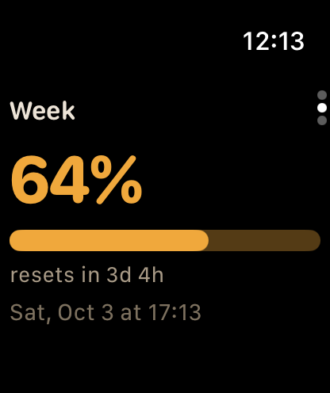
  
</p>

Turn the Digital Crown to go from the session to the week and the models. The complications come in circular, rectangular,
corner and inline shapes.

### Mac

<p>
  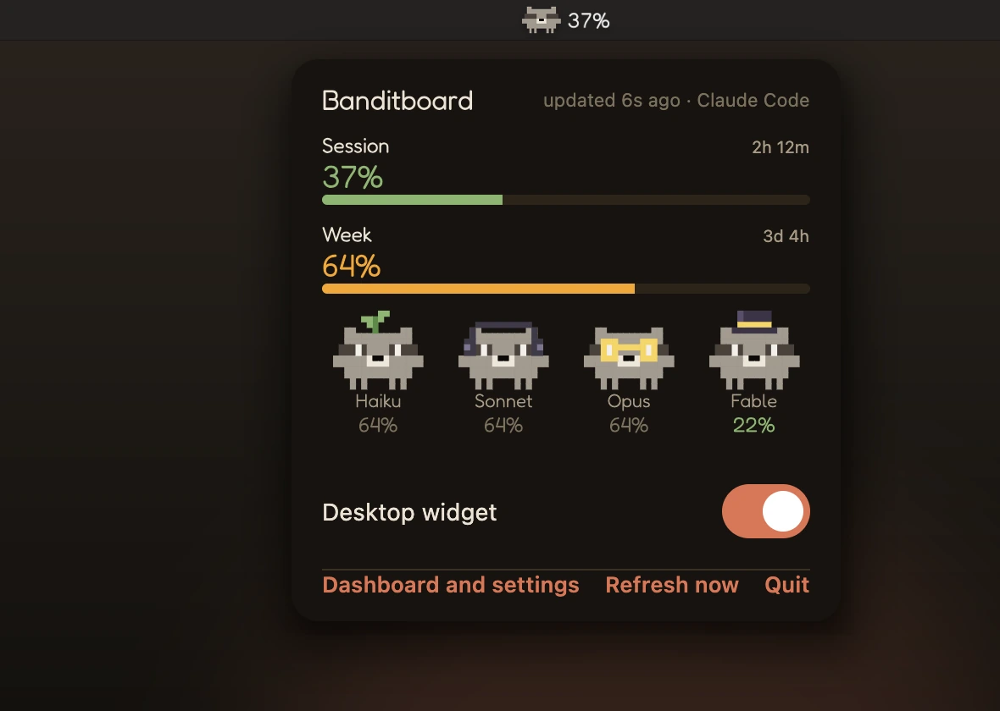
  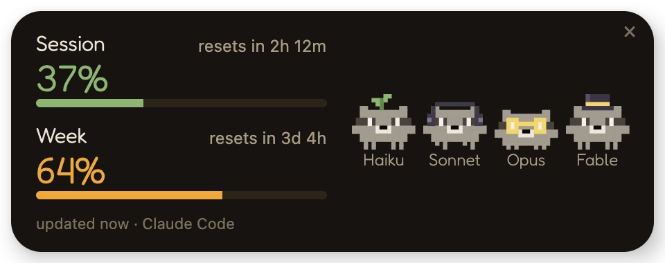
</p>

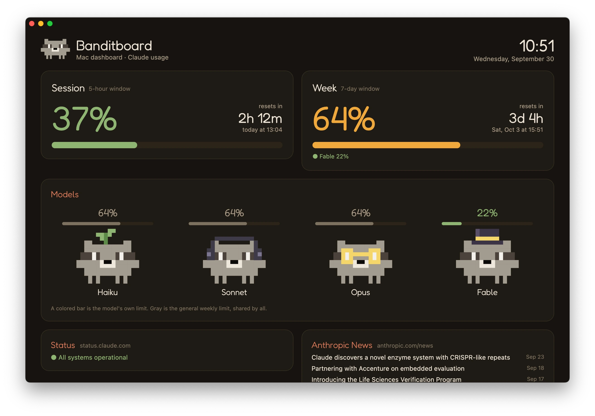

Click Racco in the menu bar for the small panel. From there you can turn the desktop widget on or off, open the dashboard or
refresh now. The dashboard has every setting, "Open at login" and the code to pair the iPhone.

### Windows widget

<p>
  
  
  
</p>


Full, compact or just Racco: pick the layout in the tray icon menu. Double-click any widget, or pick "Dashboard and settings" in
the tray, to open the dashboard: the same cards as the phone's web dashboard, every widget setting and the credits, with a QR
code to get the phone app. Drag the widget anywhere; it remembers the spot, can stay out of the taskbar and can start with
Windows. When music plays on Windows, the raccoons dance. With a single Claude Code session open, Just Racco and the compact
widget wear that session's model accessory (glasses for Opus, a top hat for Fable).

### Racco reactions

| | | |
|---|---|---|
|  |  |  |
| Empty session: asleep | 88%: sweating | 97%: red and shaking |
|  |  |  |
| 100%: burst | Fable's own limit at 100%: only Fable bursts | Music playing: dancing |

Opus is gray with X eyes in these shots because the sample data includes an open incident on status.claude.com.

### Music mode


## 🛠️ Troubleshooting

- **Windows says "Windows protected your PC".** The installer is not digitally signed yet. Click "More info" and then "Run anyway". If you want to be sure it is the right file, compare its [SHA-256](#-security) with the one in the release.
- **macOS says it can't verify Banditboard.** The app is not notarized yet. Go to System Settings → Privacy & Security and click "Open Anyway". You only need to do this once.
- **Android won't install the APK.** It comes from GitHub, not from the Play Store, so Android asks you to allow "install unknown apps" for the browser or file manager that opened it.
- **The iPhone app stopped opening.** With a free Apple ID, sideloaded apps last 7 days. Refresh it in AltStore or install the IPA again with Sideloadly; the pairing stays.
- **"Restricted setting" when turning on music mode.** On Android 13 and later, an APK installed from a browser or file manager can't get notification access right away. Go to Settings → Apps → Banditboard → ⋮ → Allow restricted settings, and try again.
- **The phone stopped updating after the router restarted.** With the PIN pairing, the phone probably got a new IP. The screen and the dashboard footer always show the current address: open it on the PC and run the command again. To avoid this, reserve a fixed IP for the phone in the router, or connect from anywhere through the website.
- **Windows can't connect Claude Code.** The widget shows the reason, and "What to do" opens the dashboard with the next step and the exact PowerShell error. The details go to `%APPDATA%\Banditboard\conectar.log` (without the pairing key), which you can attach to an [issue](../../issues).
- **The numbers don't move.** The hook runs after Claude Code responses, at most every 2 minutes. To fetch now, use "Refresh now" on the Windows or Mac dashboard, in the tray menu or in the Mac menu bar panel.

## 🧭 Roadmap

- [Linux: a shell version of the usage hook](../../issues/1)
- iPhone and Apple Watch on TestFlight and the App Store, with push alerts
- Wear OS app for Galaxy Watch and other Android watches
- [Android 16: target API 36](../../issues/4)

The issues are written in Portuguese.

## 📚 Docs

- [How it works](docs/how-it-works.md): the data flow, every setting and where the data comes from
- [Development](docs/development.md): building, testing, diagnostics over ADB and how the code is organized
- [Contributing](CONTRIBUTING.md)

## 🤝 Contributing

Issues and pull requests are welcome. For bigger changes, open an issue first so we can talk about it. See
[CONTRIBUTING.md](CONTRIBUTING.md) for how the project is organized and where the explanations live.

Questions and ideas go to [Discussions](../../discussions); bugs go to [Issues](../../issues).

## 📄 License and disclaimer

Licensed under the [MIT License](LICENSE). The Fredoka font is distributed under the SIL Open Font License; its text ships
inside the APK in `assets/licenses/`.

Banditboard is a personal fan project, **not affiliated with, endorsed by or sponsored by Anthropic**. Claude and Claude Code are
trademarks of Anthropic, PBC. Android is a trademark of Google LLC; iPhone, Apple Watch, macOS and StandBy are trademarks of
Apple Inc.; Windows is a trademark of Microsoft Corporation.

Built with ❤️ by [Vinícius Pires da Silva](https://www.linkedin.com/in/viniciuspiresdasilva/).

**Like it? Leave a ⭐**
