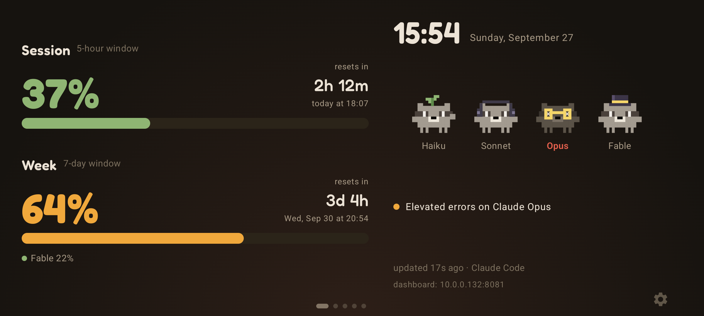
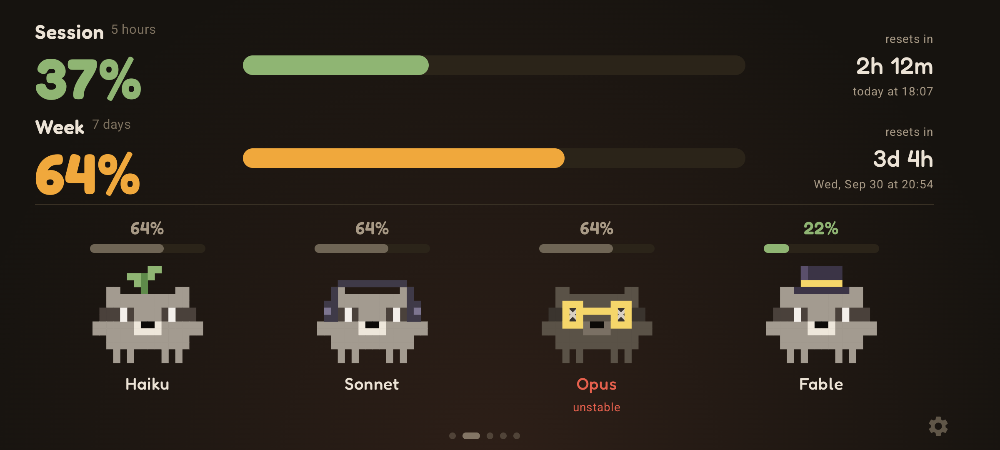
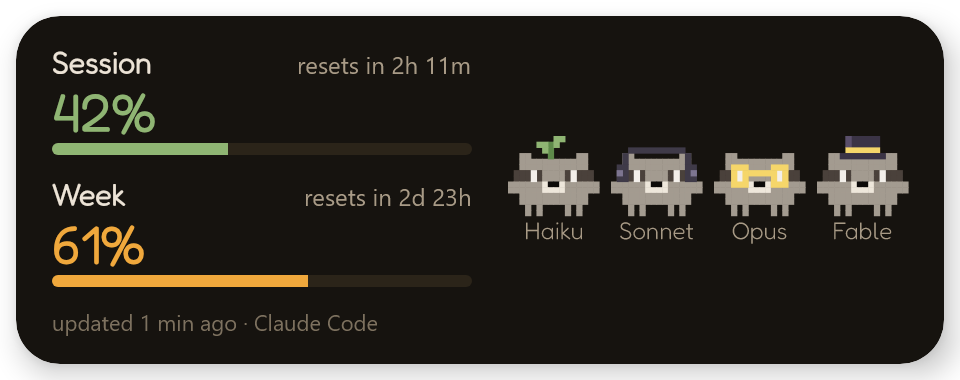
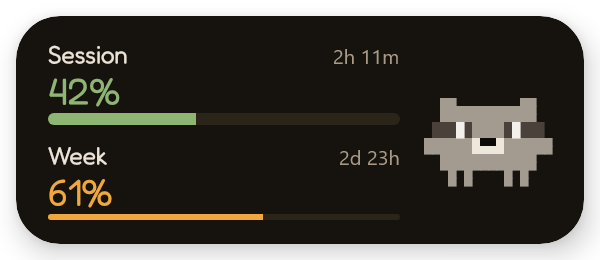
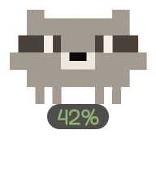
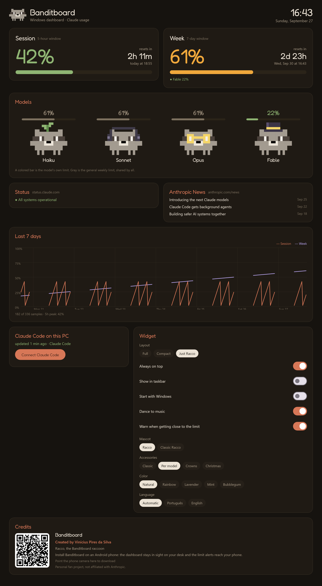
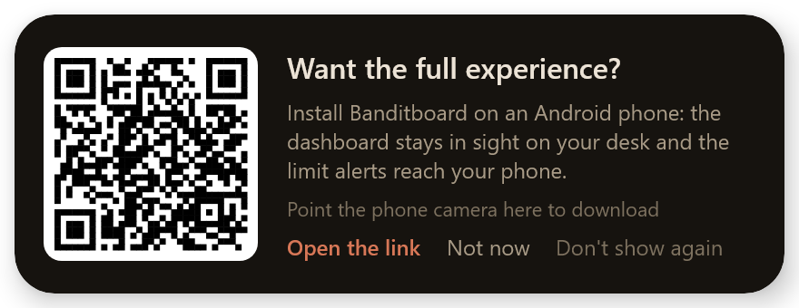
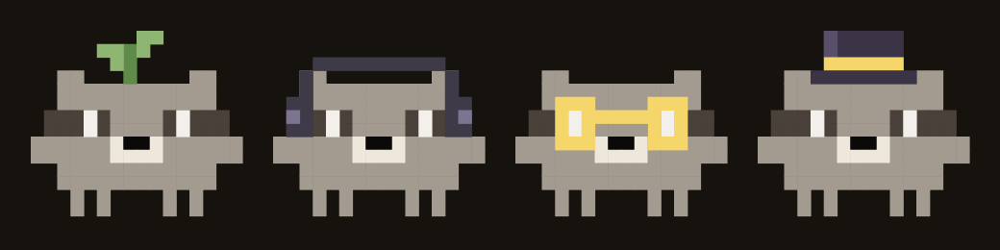

# 🦝 Banditboard

<p align="right"><b>Português</b> · <a href="README.en.md">English</a></p>

**Use aquele celular Android parado, ou só o seu PC com Windows, para acompanhar o uso do Claude Code.**

<p align="center">
  
</p>

<p align="center">
  <a href="../../releases/latest"></a>
  
  
  
  <a href="../../stargazers"></a>
</p>

<p align="center"><b><a href="../../releases/latest">Baixe o app para Android ou para Windows</a></b> · <a href="https://banditboard.pages.dev/">Site</a> · <a href="../../releases">Todas as versões</a></p>

## O que é o Banditboard?

É um painel que fica ligado na sua mesa mostrando o seu uso do Claude. Foi pensado para aquele celular antigo esquecido
na gaveta. Ele mostra quanto você já gastou da sessão de 5 horas e da semana, quando cada uma libera e se algum modelo está
com problema. Cada modelo é o Racco, um guaxinim em pixel art que dorme, sua, estoura quando chega em 100% e dança quando
toca música.

Não tem um celular sobrando? No Windows, o Banditboard vira um widget pequeno, sempre à vista, que funciona sozinho. E dá
para usar os dois juntos: o mesmo hook manda o uso para o celular e para o PC.

## ✨ O que ele faz

- 📊 **Uso num piscar de olhos**: sessão de 5 horas e semana, com contagem regressiva e a hora em que cada uma libera
- 🦝 **Racco, o guaxinim**: um para cada modelo (Haiku, Sonnet, Opus e Fable). Eles piscam, acenam, dormem quando a sessão está vazia, começam a suar em 85%, ficam vermelhos em 90% e estouram em 100%. Quem preferir o Racco clássico, mais detalhado, escolhe nas configurações
- 🔔 **Avisos de limite**: notificação quando a sessão ou a semana chegam em 80%, 90% e 100%, e outra quando liberam, mesmo com o app fechado
- 🪟 **Widget no Windows**: completo, compacto ou só o Racco no canto da tela, sempre por cima das janelas, com avisos do próprio Windows
- 🔌 **Sem token no celular**: os números vêm do `/usage` do próprio Claude Code, no seu PC, pela rede de casa
- 🎵 **Modo música**: mostra o que está tocando no celular (Spotify, YouTube Music ou qualquer outro), com capa, controles e volume, e os guaxinins dançam em todas as telas
- 📈 **Histórico de 7 dias**: uma medição a cada 30 minutos
- 🖥️ **Painel web**: a mesma tela no navegador do PC, dentro da sua rede, protegida por PIN
- 🚦 **Status e notícias**: problemas em aberto no status.claude.com e as últimas notícias da Anthropic
- 🌙 **Preto AMOLED**: e a tela se mexe alguns pixels por minuto para não marcar
- 🌍 **Português e inglês**: segue o idioma do celular, ou você escolhe
- 📱 **Em pé ou deitado**: um layout para cada, e zoom de 90% a 150%

## 📱 Como ele é

O app está em português e em inglês e segue o idioma do celular. Para trocar, vá em Configurações → Tela → Idioma.
Os prints abaixo estão em inglês.

### Telas principais

| | | |
|---|---|---|
|  |  |  |
| Painel | Mascotes | Relógio de mesa |

### Avisos de limite


Para os avisos chegarem com o app fechado, o celular deixa uma notificação discreta enquanto espera o PC. Se não quiser
os avisos, desligue em Configurações → Tela.

### Widget no Windows

<p>
  
  
  
</p>



O widget tem três formatos, que você troca pelo ícone perto do relógio do Windows: completo, compacto ou só o Racco.
O "Só o Racco" fica quietinho num canto mostrando a sessão. Dê dois cliques em qualquer widget, ou escolha "Abrir painel"
no ícone, para abrir o painel: são os mesmos cartões do painel web do celular (sessão, semana, modelos, status, notícias e
o gráfico de 7 dias), mais as configurações do widget e os créditos, com um QR code para baixar o app do celular.

Dá para arrastar o widget para onde quiser, tirar ele da barra de tarefas e fazer ele abrir junto com o Windows. Quando
toca música no PC (Spotify, navegador, qualquer coisa que apareça nos controles de mídia do Windows), os guaxinins dançam.
Se só uma sessão do Claude Code estiver aberta, o "Só o Racco" e o widget compacto usam o acessório do modelo dela: óculos
no Opus, cartola no Fable. Com mais de uma, o Racco fica sem acessório.

Se o celular não estiver conectado, o widget lembra do app do celular mais ou menos uma vez por semana, com o QR code.
"Não mostrar de novo" desliga o lembrete.



### Reações do Racco

Os prints abaixo são do Racco clássico. O Racco novo, que vem por padrão, é assim:



| | | |
|---|---|---|
|  |  |  |
| Sessão vazia: dormindo | 88%: suando | 97%: vermelhos e tremendo |
|  |  |  |
| 100%: estourados | Limite do Fable em 100%: só ele estoura | Tocando música: dançando |

### Modo música

| | |
|---|---|
|  |  |
| Capa, música, controles e volume | Com o celular em pé |

### Visuais e configurações

| | | |
|---|---|---|
|  |  |  |
| Uma cor para cada modelo | Natal | Configurações com zoom de 150% |

### Painel web, AMOLED e créditos

| | | |
|---|---|---|
|  |  |  |
| Painel web no navegador do PC | Preto AMOLED | Créditos |

## 🚀 Para começar

**No celular:**

1. Baixe o APK em [Releases](../../releases/latest) e instale. O Android vai pedir para permitir "instalar apps desconhecidos" no app que abriu o arquivo.
2. No PC, abra o endereço que aparece no celular e crie um PIN.
3. No cartão "Claude Code no seu PC", clique em "Copiar" e cole o comando no PowerShell.
4. Use o Claude Code normalmente, no VS Code ou no terminal. A cada resposta, o celular atualiza.

**Só no Windows, sem celular:**

1. Baixe o `Banditboard-<versão>.msi` em [Releases](../../releases/latest) e instale. Não precisa ser administrador. Se preferir não instalar nada, descompacte o `Banditboard-<versão>-windows.zip` onde quiser e abra o `Banditboard.exe`.
2. Clique em "Conectar Claude Code" no widget. O uso já aparece em seguida.
3. Use o Claude Code normalmente. A cada resposta, o widget atualiza. Para buscar na hora, use "Atualizar agora" no painel ou no menu da bandeja.

Vai usar os dois? Conecte cada um uma vez. O hook guarda a lista de destinos em `~/.claude/clawdboard-targets.json` e
manda o uso para todos. Se o celular já estava conectado, não precisa mexer nele: ao conectar o Windows, o celular entra
na lista sozinho.

> Depois das respostas, um hook do Claude Code roda o `/usage`, no máximo a cada 2 minutos, e isso não gasta tokens.
> O uso do claude.ai e de outros aparelhos também entra na conta, porque o `/usage` mostra o plano inteiro. Por enquanto,
> o script do PC só funciona no Windows.

## 🔐 Segurança

- O celular não guarda token do Claude e nunca fala com a API da Anthropic. Quem lê os limites é o próprio Claude Code, no seu PC, com o `/usage`, e um script pequeno só repassa os números. O script não mexe nas credenciais do Claude Code.
- O script manda apenas as porcentagens, a hora em que cada limite libera e qual modelo cada sessão ativa está usando ("opus", "sonnet"...). Nada das suas conversas, dos seus arquivos ou dos IDs das sessões.
- Cada envio leva uma chave de pareamento de 128 bits. O celular compara com um hash SHA-256, e "Criar chave nova" invalida o comando antigo na hora.
- A chave de pareamento fica criptografada com AES-256-GCM, com uma chave tirada do seu PIN (PBKDF2, 150.000 iterações) e protegida pelo Android Keystore. O PIN não fica salvo em lugar nenhum.
- Errou o PIN 10 vezes seguidas? A chave de pareamento, o histórico e as configurações são apagados.
- O painel web só funciona dentro da sua rede, pede o mesmo PIN e só responde quando o endereço é um IP, `localhost` ou um nome `.local`, o que impede ataques de DNS rebinding. Entrar no painel também desbloqueia a tela do celular.
- O instalador faz um backup das configurações do Claude Code em `settings.json.antes-do-clawdboard`, adiciona dois hooks (`Stop` e `SessionStart`) e não mexe na sua status line.
- O app do Windows só atende em `127.0.0.1`, então ninguém da sua rede consegue acessar ele, e mesmo assim ele confere a chave de pareamento a cada envio.
- O modo música precisa de acesso às notificações porque é só assim que o Android mostra o player que está tocando. O Banditboard usa isso para ver e controlar o player; ele não lê as suas notificações.

## 🔧 Por dentro

### Como funciona

```
 Claude Code no seu PC (VS Code ou terminal)
          │  hook Stop / SessionStart, no máximo a cada 2 minutos
          ▼
 clawdboard-usage.ps1 ──► claude -p "/usage"   (comando local, sem tokens, com os hooks desligados)
          │
          └──► POST para cada destino do clawdboard-targets.json   (chave de pareamento, só os números)
                 ├──► http://IP-DO-CELULAR:8080/api/push
                 └──► http://127.0.0.1:47810/api/push   (app do Windows)

 ┌──────────────────┐
 │ Celular Android  │ ──► status.claude.com    problemas em aberto
 │   Banditboard    │ ──► feed RSS público     notícias da Anthropic
 └──────────────────┘
          ├──► 🦝 guaxinins na tela do celular
          └──► painel web na sua rede (http://IP-DO-CELULAR:8080)

 O modo música só lê e controla o player do próprio celular. Não precisa de conta nenhuma.
```

### Configuração

**Primeira vez.** O celular mostra o endereço dele, algo como `http://192.168.0.15:8080`. A porta é a primeira livre entre
8080 e 8089, e o PC e o celular precisam estar no mesmo Wi-Fi. Se preferir, crie o PIN no próprio celular, em "Prefiro criar
o PIN neste celular", e conecte o Claude Code depois pelo painel. Quando o roteador reinicia, o celular pode mudar de IP; a
tela e o rodapé do painel sempre mostram o endereço atual. Para não ter esse problema, reserve um IP fixo para o celular no
roteador. Se o IP mudar, é só rodar o comando do painel de novo.

**Conectando o Claude Code.** O comando baixa um instalador do celular. Ele salva o `~/.claude/clawdboard-usage.ps1`, coloca
o celular na lista `~/.claude/clawdboard-targets.json` e registra o script como hook `Stop` e `SessionStart` no
`~/.claude/settings.json`. O hook termina na hora e, no máximo a cada 2 minutos, roda escondido um
`claude -p "/usage" --no-session-persistence` com os hooks desligados, pega as linhas da sessão, da semana e de cada modelo e
envia. Ele usa o `claude` que estiver no PATH ou o que vem com a extensão do VS Code. Para desfazer, volte o
`settings.json.antes-do-clawdboard` ou apague os dois hooks `clawdboard-usage`. Se a hora de liberar passa e nenhum envio
novo chega, o celular zera aquela janela sozinho.

**No celular.** Arraste para a esquerda para ver a próxima tela e para a direita para voltar. Fora do carrossel, ele volta
para a tela inicial depois de 30 segundos. A engrenagem no canto de baixo abre as configurações, depois de pedir o PIN.
Quando o celular ou o app reinicia, a tela pede o PIN de novo, e dá para desbloquear pelo painel web. O rodapé mostra quando
chegou o último envio.

**Telas e modos.** Painel, mascotes (sessão e semana em cima, os quatro Raccos embaixo), gráfico de 7 dias, notícias, relógio
de mesa e música, se estiver ligada. A tela pode ficar fixa, nos mascotes, no carrossel ou no relógio. No carrossel, a tela de
música só aparece quando algo está tocando.

**Barra de cada modelo.** Quando o `/usage` mostra um limite semanal só de um modelo (hoje só o Fable, em alguns planos), a
barra dele fica colorida. Os outros modelos usam o limite semanal geral, por isso aparecem em cinza.

**Visuais.** No "Por modelo", que é o padrão, o Fable, o mais caro, ganha uma cartola, o Opus usa óculos, o Sonnet usa fone e
o Haiku tem um broto na cabeça. Também tem o "Clássico" (sem acessório), "Coroas" e "Natal", e cinco cores: natural (o cinza
do guaxinim), arco-íris (uma cor para cada modelo), lavanda, menta e chiclete. O painel web desenha o mesmo visual com a
definição que o app manda em `state.look`.

**Animações.** Além de piscar, eles olham para os lados, mexem as pernas, acenam, mexem as orelhas e se abaixam. Com a sessão
de 5 horas zerada, eles dormem (olhos fechados e um Z). Em 85% começam a suar e ficam agitados; em 90% ficam vermelhos e
pulsam; em 95% tremem. Em 100% estouram e ficam queimados, com olhos em X e fumaça, e aparece "esgotado". Se a sessão ou a
semana geral chegam em 100%, os quatro estouram; se só o limite do Fable chega em 100%, só ele estoura. Quando o
status.claude.com tem um problema que cita um modelo, o guaxinim dele fica cinza, com olhos em X. Dá para desligar as
animações nas configurações.

**Música.** Vá em Configurações → Música → "Tela de música", toque em "Dar acesso" e permita o Banditboard. Ele não toca nada
sozinho: só lê e controla o player do app que está tocando. A tela mostra a capa, a música, o ícone do app (um toque abre o
player, para trocar de playlist), a barra de progresso, os botões, os botões extras do app e o volume, que é o volume de mídia
do celular ou, se o som estiver saindo em outro aparelho, o volume desse aparelho. Enquanto a música toca, todos os guaxinins
dançam em todas as telas, inclusive no painel web: os que estavam dormindo acordam, os suados dançam suando e os estourados
batem o pé. Se você instalou o APK pelo navegador ou por um gerenciador de arquivos, o Android 13 ou mais novo pode avisar que
é uma "configuração restrita". Nesse caso, vá em Configurações → Apps → Banditboard → ⋮ → Permitir configurações restritas e
tente de novo.

**Zoom e modo compacto.** 90, 100, 115, 130 ou 150% nas telas e nas configurações; as telas de bloqueio e de PIN ficam no
tamanho do sistema. Quando o lado menor da tela passa a ter menos de 380dp (zoom alto ou celular pequeno), as telas mudam para
um layout compacto e escondem as linhas menos importantes.

**Fundo.** O "Tema padrão" usa tons escuros e quentes (#16130f, com um brilho coral embaixo). O "Preto AMOLED" economiza mais
a tela.

**Feedback.** Depois de 3 dias de uso, aparece um cartão perguntando se você está gostando, com um botão que abre um e-mail
para vinips00@gmail.com. Ele some sozinho depois de 30 segundos, volta a cada 10 dias e tem "Não mostrar de novo". Se você
mandar um e-mail, ele só volta depois de 60 dias. O mesmo contato está nos créditos das configurações e no rodapé do painel web.

**Abrir quando o celular ligar.** Precisa de uma permissão que só o ADB consegue dar. Sem ela, o app funciona normal, só não
abre sozinho depois de reiniciar:

```powershell
adb shell appops set dev.clawdboard SYSTEM_ALERT_WINDOW allow
```

**Atualizando.** É só instalar o APK novo por cima do antigo: o PIN, as configurações e o histórico continuam, desde que o APK
seja assinado com a mesma chave. Depois de atualizar, o app pede o PIN uma vez. Quem vem da 1.4 ou de antes troca o token do
Claude salvo por uma chave de pareamento no primeiro desbloqueio; depois disso, conecte o Claude Code pelo painel.

### De onde vêm os dados

- **Uso:** a saída do `claude -p "/usage"`, um comando local do Claude Code que não chama nenhum modelo. Ele lê as linhas "Current session", "Current week (all models)" e "Current week (<modelo>)", com a hora em que cada uma libera.
- **Status:** `https://status.claude.com/api/v2/incidents/unresolved.json`
- **Notícias:** o feed RSS público `Olshansk/rss-feeds`.

### Desenvolvimento

Você vai precisar do JDK 17 e do Android SDK com a API 35 (no `ANDROID_HOME` ou no `sdk.dir` do `local.properties`):

```powershell
.\gradlew.bat testReleaseUnitTest assembleDebug
adb install -r app\build\outputs\apk\debug\app-debug.apk
```

O `assembleDebug` gera a versão de teste `dev.clawdboard.preview`, que fica instalada ao lado do app de verdade sem mexer
nos dados dele e aceita os dados de exemplo mais abaixo. O `assembleRelease` gera o app normal, que vai para a pasta `dist\`.

Na minha máquina eu uso os atalhos da pasta `scripts\`, que já apontam para o Gradle em `D:\Android\gradle-home` e para o JDK que veio com o Visual Studio:

```powershell
.\scripts\compilar.ps1
.\scripts\instalar.ps1 -Ip 192.168.0.15   # IP do celular com ADB por Wi-Fi; sem -Ip, usa o celular de teste
```

App do Windows (Compose Desktop, com o mesmo núcleo e o mesmo guaxinim do celular):

```powershell
.\gradlew.bat :desktop:run          # abre o widget
.\gradlew.bat :desktop:packageMsi   # gera o instalador em desktop\build\compose\binaries\main\msi
.\gradlew.bat :desktop:shots        # gera os prints do widget e do painel em prints\
```

Diagnóstico pelo ADB:

```powershell
adb shell am start -n dev.clawdboard.preview/dev.clawdboard.MainActivity --ez demo true --es lang PT --es mode MASCOTS --es orient PORTRAIT
# demo: dados de exemplo, só funciona antes de criar o PIN; mode, orient e backdrop são opcionais
# também: --ei zoom 150, --es skin XMAS, --es tint RAINBOW, --ei p5 0 (sessão vazia, dormindo), --ei p7 97 (vermelho), --ez nudge true (cartão de feedback)
# --ez music true liga a tela de música com uma música de exemplo tocando (guaxinins dançando); --ez playing false deixa pausada
adb shell am start -n dev.clawdboard/.MainActivity --ez selftest true  # testa o cofre no aparelho
adb logcat -s ClawdSelfTest
```

### Por que Kotlin

O app do celular e o do Windows são o mesmo código em Kotlin. O Jetpack Compose desenha as telas do Android e o Compose
Multiplatform desenha o widget do Windows. Por isso o Racco, as animações, as regras dos avisos, a leitura do uso e os textos
em português e inglês ficam num lugar só: mexeu no guaxinim uma vez, os dois apps já recebem.

### Organização do código

- `core/`: pareamento e envio, cofre, histórico, configurações, música (player do Android) e o servidor do painel web
- `ui/`: as telas em Jetpack Compose e o guaxinim em pixel art
- `MediaListener.kt`: o leitor de notificações que o Android exige para enxergar o player
- `assets/panel.html`: o painel web, sem nenhuma dependência externa
- `assets/pc/`: o instalador em PowerShell e o hook de uso que o celular entrega para o seu PC
- `desktop/`: o widget do Windows, o servidor local e o ícone da bandeja, feitos com os mesmos arquivos de `core/` e `ui/`

### Próximos passos

- **macOS e Linux:** uma versão do hook em shell.
- **Android 16:** passar para a API 36.

## 🤝 Quer ajudar?

Issues e pull requests são bem-vindos. Para mudanças maiores, abra uma issue antes para a gente conversar. O código não tem
comentários de propósito: as explicações ficam neste README. Os textos do app estão em `core/Texts.kt`, em português e em
inglês. Sugestões e ideias: vinips00@gmail.com.

## 📄 Licença e aviso

Ainda não há uma licença de código aberto, então todos os direitos são reservados. A fonte Fredoka é distribuída pela SIL Open
Font License, e o texto da licença vai dentro do APK, em `assets/licenses/`.

O Banditboard é um projeto pessoal de fã, **sem vínculo, apoio ou patrocínio da Anthropic**. Claude e Claude Code são marcas da
Anthropic, PBC.

Feito com ❤️ por Vinícius Pires da Silva.
