# 🦝 Banditboard

<p align="right"><b>English</b> · <a href="README.pt-BR.md">Português</a></p>

**Turn an old Android phone, or just your Windows PC, into a Claude Code usage monitor.**

<p align="center">
  
</p>

<p align="center">
  <a href="../../releases/latest"></a>
  <a href="../../releases"></a>
  <a href="LICENSE"></a>
  <a href="../../commits/main"></a>
  
  
  <a href="../../stargazers"></a>
</p>

<p align="center"><b><a href="#-get-started">Get started</a></b> · <a href="https://banditboard.pages.dev/en/">Website</a> · <a href="../../releases">All releases</a></p>

## What is Banditboard?

Banditboard is an always-on desk display for your Claude usage, made for that old Android phone sitting in a drawer.
It shows how much of the 5-hour session and of the week you have used, when each one resets and whether any model has
an open incident. Each model is Racco, a pixel-art raccoon who sleeps, sweats, bursts at 100% and dances when music plays.

No spare phone? The Windows app is a small always-on-top widget that works on its own, and it can run next to the phone app:
the same hook feeds both.

### Why Banditboard?

You usually only check your limits when you remember to run `/usage`, and the session tends to run out right in the middle of
a task. Banditboard keeps the numbers in sight all the time, on a phone next to your monitor or in a widget in the corner of
the screen, and warns you at 80%, 90% and 100%. No terminal to keep open, no tab to refresh. The numbers come from Claude Code
itself, so there is no token or login to hand over.

## ✨ Features

- 📊 **Usage at a glance**: 5-hour session and 7-day week, with a countdown and the local time each one resets
- 🦝 **Racco, the raccoon**: one per model (Haiku, Sonnet, Opus and Fable). They blink, wave, sleep when the session is empty, sweat from 85%, turn red from 90% and burst at 100%. The classic, more detailed Racco is still one tap away in the settings
- 🔔 **Limit alerts**: a notification at 80%, 90% and 100% of the session or the week, and another when it resets, even with the app closed
- 🪟 **Windows widget**: full, compact or just Racco in a corner of the screen, always on top, with alerts from Windows itself
- 🔌 **No token on the phone**: the numbers come from Claude Code's own `/usage` on your PC, over the local network
- 🎵 **Music mode**: whatever plays on the phone (Spotify, YouTube Music or any player), with cover, controls and volume, while the raccoons dance on every screen
- 📈 **7-day history**: one sample every 30 minutes
- 🖥️ **Web dashboard**: the same view in your PC browser, on the local network, with PIN login
- 🚦 **Status and news**: open incidents from status.claude.com and the latest Anthropic news
- 🌙 **AMOLED black**: plus a few pixels of shift per minute against burn-in
- 🌍 **English and Portuguese**: follows the phone's language, or pick one in the settings
- 📱 **Portrait and landscape**: a layout for each, and accessibility zoom from 90% to 150%

## 🚀 Get started

| Platform | File | |
|---|---|---|
| Android 8.0 or newer | `Banditboard-<version>.apk` | [Download](../../releases/latest) |
| Windows 10 or newer, installer | `Banditboard-<version>.msi` | [Download](../../releases/latest) |
| Windows 10 or newer, portable | `Banditboard-<version>-windows.zip` | [Download](../../releases/latest) |

**On the phone:**

1. Download the APK and install it (allow "install unknown apps" for the app that opens the file).
2. On your PC, open the address shown on the phone and create a PIN.
3. On the "Claude Code on your PC" card, click "Copy" and paste the command into PowerShell.
4. Keep using Claude Code, in VS Code or in the terminal. After a response, the phone updates.

**Only Windows, no phone:**

1. Install the MSI (no admin needed). Prefer not to install? Unzip the ZIP anywhere and run `Banditboard.exe`.
2. Click "Connect Claude Code" on the widget. Usage shows up right away. If it can't connect, the widget says why and "What to do" opens the dashboard with the next step.
3. Keep using Claude Code. After a response, the widget updates. To fetch it on the spot, use "Refresh now" on the dashboard or in the tray menu.

Using both? Connect each one once. The hook keeps a list of destinations in `~/.claude/clawdboard-targets.json`
and sends to all of them. If the phone was already connected, there is nothing to redo on it: connecting Windows adds the
phone to the list by itself.

> A Claude Code hook runs `/usage` after responses, at most every 2 minutes, without using any tokens. Usage from
> claude.ai or other devices also shows up, because `/usage` reports the whole plan. The PC script is Windows-only for now
> ([macOS and Linux are on the way](../../issues/1)).

## 🔐 Security

- The phone never holds a Claude token and never calls the Anthropic API. Claude Code on your PC reads your limits with `/usage` and a small script forwards them. The script never reads Claude Code's credentials.
- The script sends only the percentages, their reset times and the model family of each session active in the last 10 minutes ("opus", "sonnet"...), nothing from your conversations, files or session IDs.
- Each push carries a 128-bit pairing key. The phone checks it against a SHA-256 hash, and "Create new key" invalidates the old command at once.
- The pairing key is encrypted with AES-256-GCM using a key derived from your PIN (PBKDF2, 150,000 iterations) and wrapped by an Android Keystore key. The PIN is never stored.
- 10 wrong PINs in a row wipe the pairing key, the history and the settings.
- The web dashboard only runs on the local network, asks for the same PIN and only answers when the Host is an IP address, `localhost` or a `.local` name, which blocks DNS rebinding. Logging in on the dashboard also unlocks the phone screen.
- The installer keeps a backup of your Claude Code settings in `settings.json.antes-do-clawdboard`, adds two hooks (`Stop` and `SessionStart`) and does not touch your status line.
- The Windows app only listens on `127.0.0.1`, so nothing on your network can reach it, and it still checks the pairing key on every push.
- Music mode needs notification access because Android only shows the active player to apps with that access. Banditboard uses it to see and control the player; it does not read your notifications.

**Read the scripts before you run them.** Everything that runs on your PC is short PowerShell you can audit:
[`install.ps1`](app/src/main/assets/pc/install.ps1) (writes the hook and edits `settings.json`),
[`usage.ps1`](app/src/main/assets/pc/usage.ps1) (the hook itself) and
[`connect.ps1`](desktop/src/main/resources/connect.ps1) (the wrapper the Windows app uses to run the installer).

**Check the download.** Every release lists the SHA-256 of the APK, the MSI and the ZIP. Compare it with yours:

```powershell
Get-FileHash .\Banditboard-1.13.2.msi -Algorithm SHA256
```

## 📱 Screenshots

### Main screens

| | | |
|---|---|---|
| 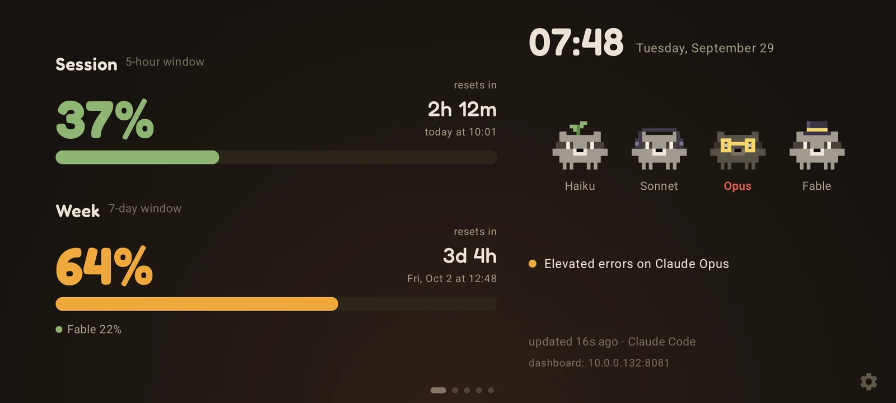 | 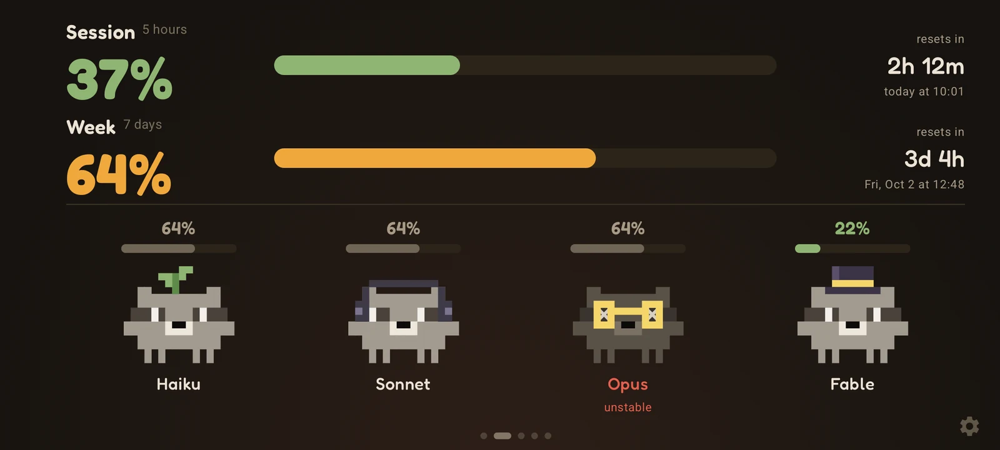 | 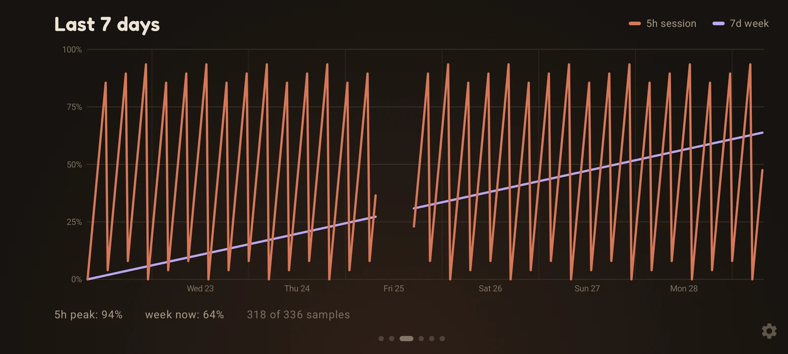 |
| Dashboard | Mascots | 7-day history |

<p>
  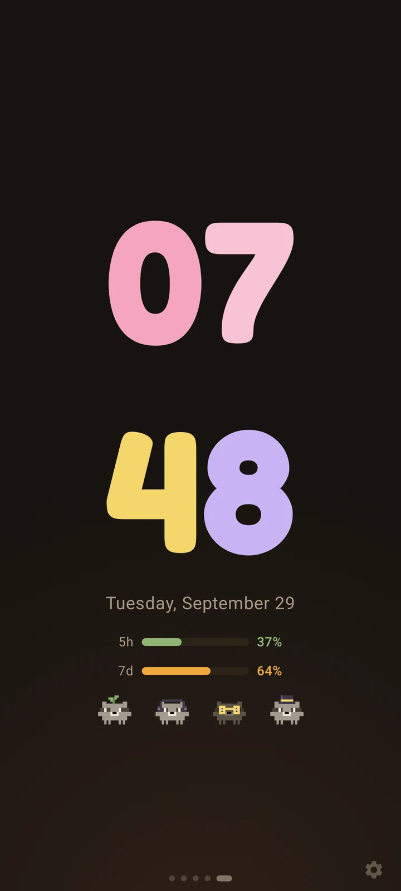
  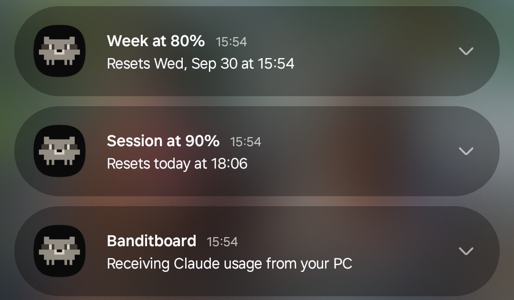
</p>

The desk clock in portrait, and the limit alerts. The phone keeps a quiet notification while it listens for your PC, so the
alerts arrive even with the app closed. You can turn them off in Settings → Screen.

### Windows widget

<p>
  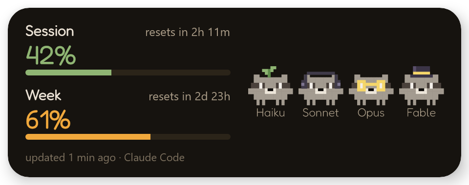
  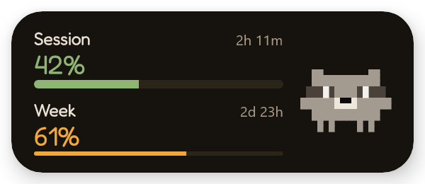
  
</p>

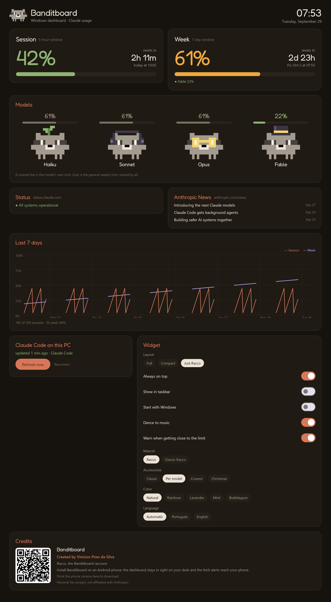

Full, compact or just Racco: pick the layout in the tray icon menu. Double-click any widget, or pick "Open dashboard" in the
tray, to open the dashboard: the same cards as the phone's web dashboard, every widget setting and the credits, with a QR code
to get the phone app. Drag the widget anywhere; it remembers the spot, can stay out of the taskbar and can start with Windows.
When music plays on Windows, the raccoons dance. With a single Claude Code session open, Just Racco and the compact widget wear
that session's model accessory (glasses for Opus, a top hat for Fable).

### Racco reactions

| | | |
|---|---|---|
| 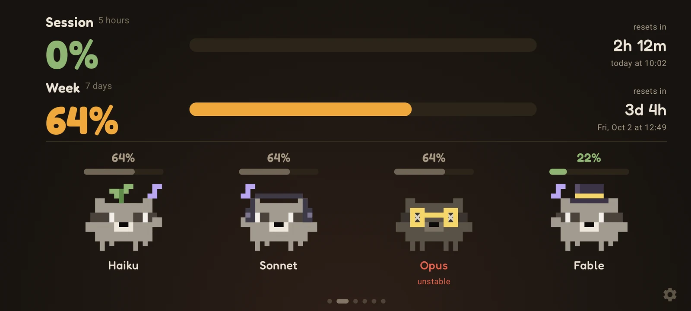 | 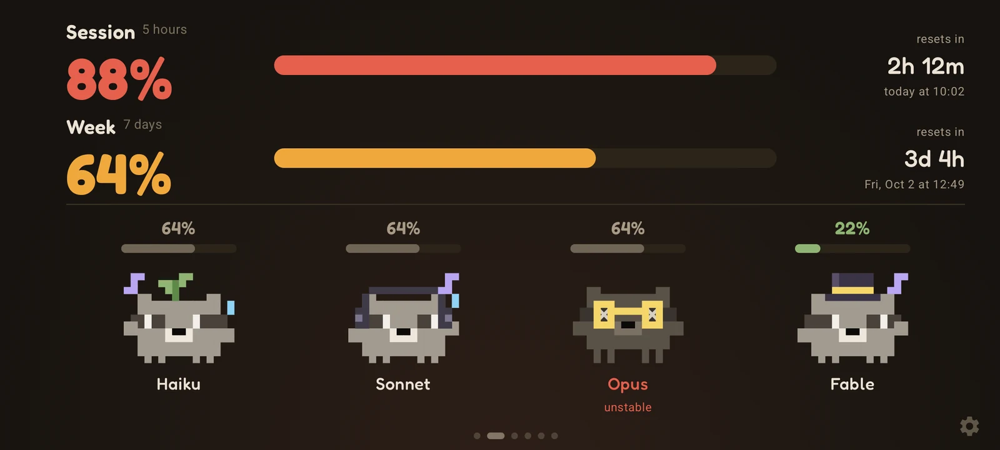 | 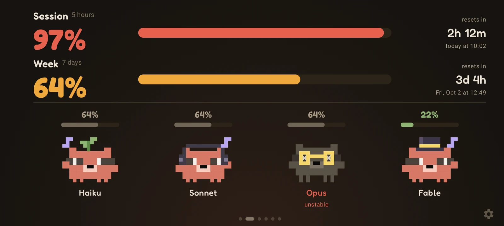 |
| Empty session: asleep | 88%: sweating | 97%: red and shaking |
| 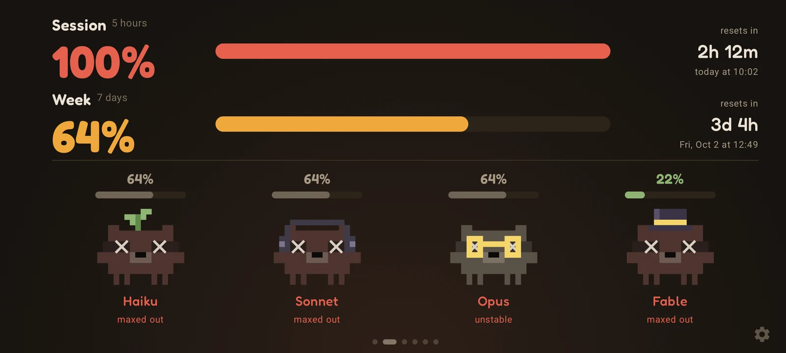 | 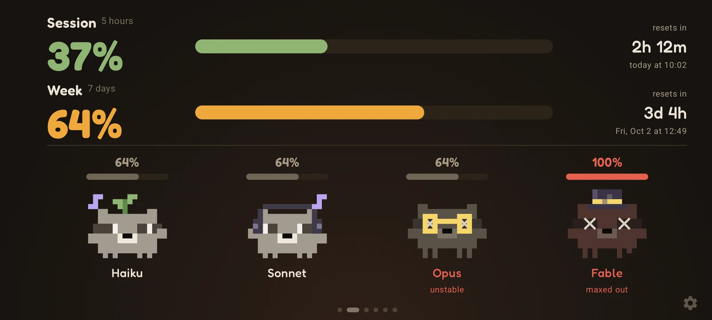 | 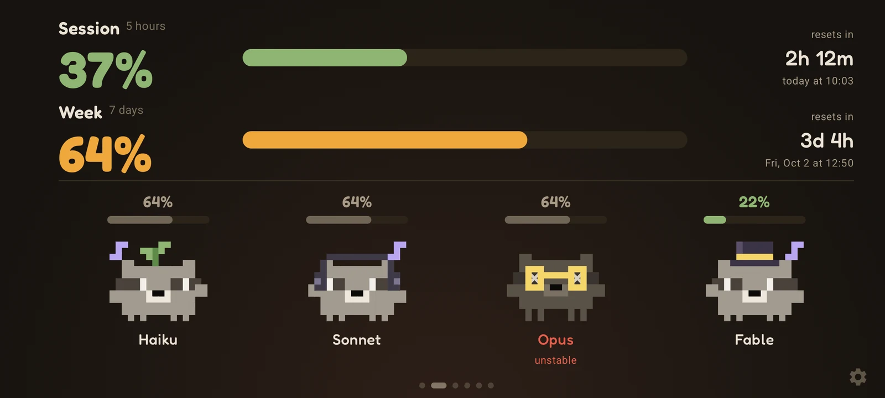 |
| 100%: burst | Fable's own limit at 100%: only Fable bursts | Music playing: dancing |

Opus is gray with X eyes in these shots because the sample data includes an open incident on status.claude.com.

### Music mode

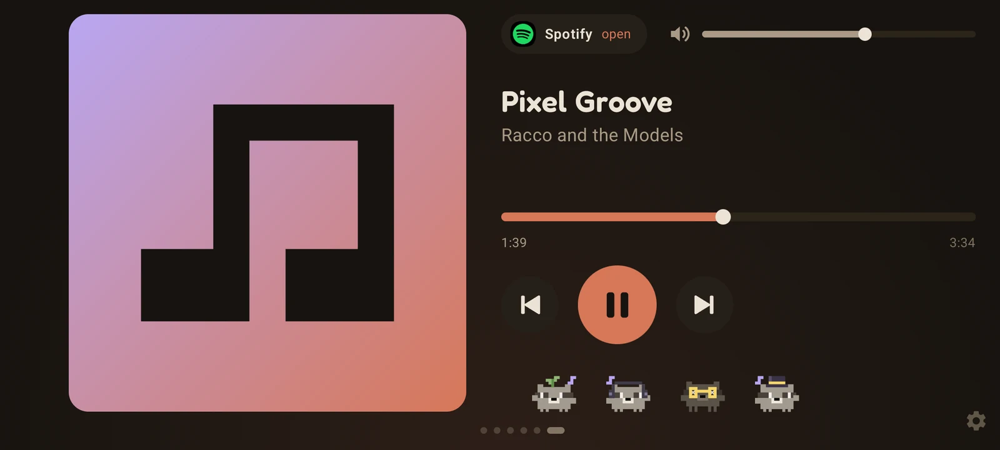

## 🛠️ Troubleshooting

- **Windows says "Windows protected your PC".** The installer is not digitally signed yet. Click "More info" and then "Run anyway". If you want to be sure it is the right file, compare its [SHA-256](#-security) with the one in the release.
- **Android won't install the APK.** It comes from GitHub, not from the Play Store, so Android asks you to allow "install unknown apps" for the browser or file manager that opened it.
- **"Restricted setting" when turning on music mode.** On Android 13 and later, an APK installed from a browser or file manager can't get notification access right away. Go to Settings → Apps → Banditboard → ⋮ → Allow restricted settings, and try again.
- **The phone stopped updating after the router restarted.** The phone probably got a new IP. The screen and the dashboard footer always show the current address: open it on the PC and run the command again. To avoid this, reserve a fixed IP for the phone in the router.
- **Windows can't connect Claude Code.** The widget shows the reason, and "What to do" opens the dashboard with the next step and the exact PowerShell error. The details go to `%APPDATA%\Banditboard\conectar.log` (without the pairing key), which you can attach to an [issue](../../issues).
- **The numbers don't move.** The hook runs after Claude Code responses, at most every 2 minutes. To fetch now, use "Refresh now" on the Windows dashboard or in the tray menu.

## 🧭 Roadmap

- [macOS and Linux: a shell version of the usage hook](../../issues/1) (help wanted)
- [iPhone app with home screen and StandBy widget](../../issues/2)
- [macOS app with a desktop widget](../../issues/3)
- [Android 16: target API 36](../../issues/4)

## 📚 Docs

- [How it works](docs/how-it-works.md): the data flow, every setting and where the data comes from
- [Development](docs/development.md): building, testing, diagnostics over ADB and how the code is organized
- [Contributing](CONTRIBUTING.md)

## 🤝 Contributing

Issues and pull requests are welcome. For bigger changes, open an issue first so we can talk about it. See
[CONTRIBUTING.md](CONTRIBUTING.md) for how the project is organized and where the explanations live.

Questions and ideas go to [Discussions](../../discussions); bugs go to [Issues](../../issues).

## 📄 License and disclaimer

Licensed under the [MIT License](LICENSE). The Fredoka font is distributed under the SIL Open Font License; its text ships
inside the APK in `assets/licenses/`.

Banditboard is a personal fan project, **not affiliated with, endorsed by or sponsored by Anthropic**. Claude and Claude Code are
trademarks of Anthropic, PBC.

Built with ❤️ by Vinícius Pires da Silva.

**Like it? Leave a ⭐**
