# 🦝 Banditboard

<p align="right"><a href="README.md">English</a> · <b>Português</b></p>

**Acompanhe os limites do Claude Code e do Antigravity num celular Android parado, no iPhone e no Apple Watch, ou num widget no Windows e no Mac.**

<p align="center">
  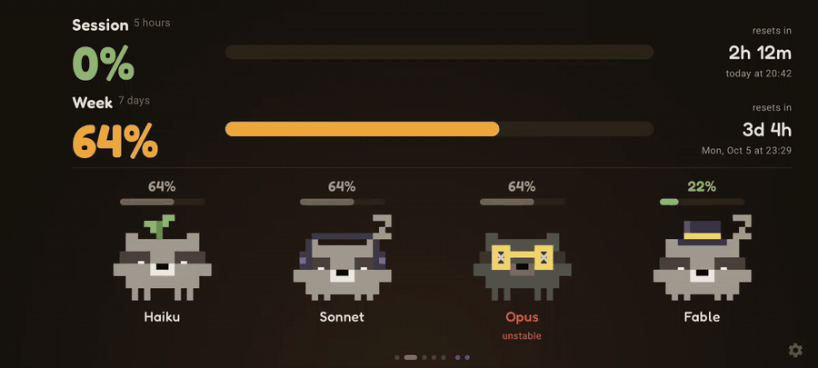
</p>

<p align="center">
  <a href="https://banditboard.pages.dev/video/banditboard-pt.mp4"></a><br>
  <sub>▶️ <a href="https://banditboard.pages.dev/video/banditboard-pt.mp4">Veja em vídeo</a></sub>
</p>

<p align="center">
  <a href="../../releases/latest"></a>
  <a href="../../releases"></a>
  <a href="LICENSE"></a>
  <a href="../../commits/main"></a>
  <a href="../../stargazers"></a>
  <br>
  
  
  
  
  
</p>

<p align="center"><b><a href="#-para-começar">Para começar</a></b> · <a href="https://banditboard.pages.dev/">Site</a> · <a href="https://banditboard.pages.dev/conectar/">Conectar de qualquer lugar</a> · <a href="../../releases">Todas as versões</a></p>

## O que é o Banditboard?

É um painel que fica sempre à vista mostrando os limites das IAs que você usa para programar: o Claude Code, o Antigravity
do Google ou os dois. Ele mostra quanto você já gastou da sessão de 5 horas e da semana, quando cada uma libera e se algum
modelo está com problema. Cada modelo é o Racco, um guaxinim em pixel art que
dorme, sua, estoura quando chega em 100% e dança quando toca música.

Começou naquele celular Android esquecido na gaveta e hoje vai para onde você olha: no iPhone, com widgets na Tela de Início
e no StandBy; no Apple Watch, com complicações no mostrador; no Windows, num widget pequeno sempre por cima das janelas; e no
Mac, com o Racco e a porcentagem da sessão na barra de menus. Use um só ou todos juntos: o mesmo hook do Claude Code manda o
uso para todos os aparelhos. Ligando a atividade do Claude, o Racco também acompanha o que o Claude Code está fazendo naquele
momento: trabalha junto, levanta a mão quando o Claude precisa de você e dorme quando ele para.

### Claude Code e Antigravity

Na primeira vez que você abre, o celular pergunta qual IA você quer acompanhar. Cada ferramenta ganha a própria cor, os
próprios Raccos e as próprias telas, e com as duas ligadas ainda tem uma tela com uma do lado da outra.

No Antigravity, o Banditboard do Windows lê a cota do Antigravity aberto no mesmo computador, do jeito que o View Usage
mostra: o Gemini de um lado, o Claude e o GPT do outro, cada um com a janela de 5 horas e a semanal. Os Raccos do Gemini Pro,
do Gemini Flash, do Claude e do GPT-OSS usam estrela, raio, óculos e gorro. A cota chega no celular pelo mesmo pareamento do
Claude Code, e os avisos chegam mesmo com o app fechado. Por enquanto, o Antigravity funciona no widget do Windows e no
Android; o Mac, o iPhone e o Apple Watch recebem depois.

<p align="center">
  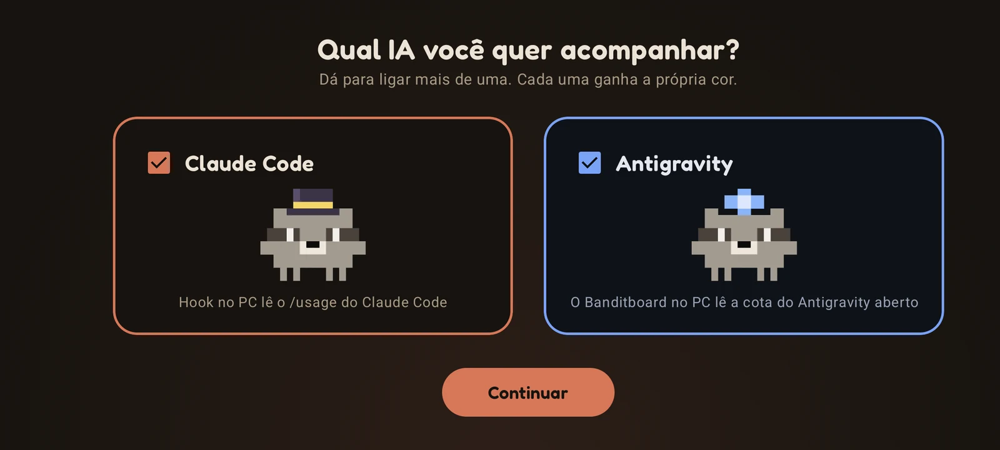
  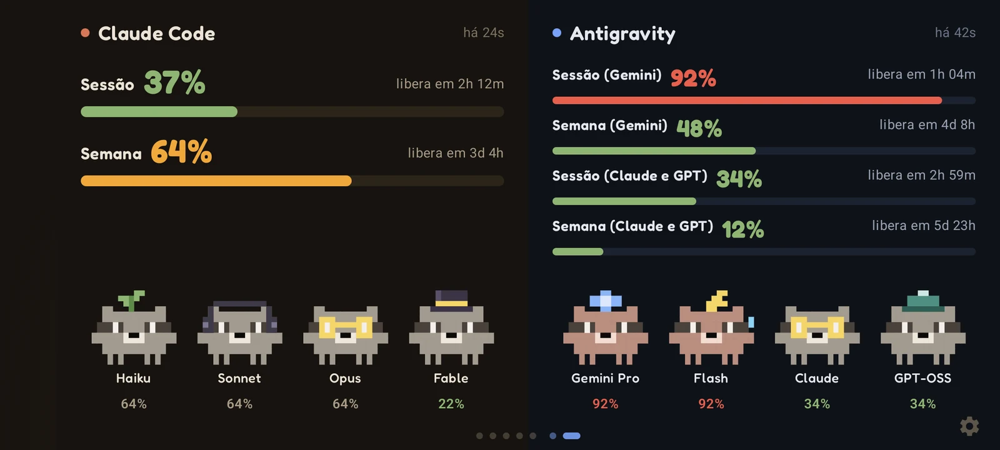
</p>

### Por que o Banditboard?

A gente só confere o limite quando lembra de rodar o `/usage`, e a sessão costuma acabar bem no meio da tarefa. O
Banditboard deixa os números sempre à vista, no celular do lado do monitor, no pulso ou num canto da tela, e avisa quando
chega em 80%, 90% e 100%. Não precisa deixar terminal aberto nem ficar atualizando aba. Os números vêm do próprio Claude Code,
então você não entrega token nem login para ninguém.

## ✨ O que ele faz

- 📊 **Uso num piscar de olhos**: sessão de 5 horas e semana, com contagem regressiva e a hora em que cada uma libera
- 🛰️ **Antigravity** (novo na 1.17.0): a cota do Gemini e a do Claude e GPT do Antigravity do Google, cada uma com a janela de 5 horas e a semanal, no widget do Windows e no Android. Acompanhe o Claude Code, o Antigravity ou os dois
- 🤖 **Atividade do Claude** (opcional): o projeto, a branch e o que o Claude Code está fazendo agora, e o Racco de cada modelo reage. Ele trabalha junto, mostra "…" enquanto roda comando, levanta a mão com "!" quando o Claude pede permissão ou tem uma pergunta, comemora quando termina e dorme quando ele para. Se o Claude continuar esperando por você, o Windows e o Android avisam. No Windows e no Android desde a 1.15.0; o Mac, o iPhone e o Apple Watch recebem na próxima versão
- 🦝 **Racco, o guaxinim**: um para cada modelo (Haiku, Sonnet, Opus e Fable). Eles piscam, acenam, dormem quando a sessão está vazia, começam a suar em 85%, ficam vermelhos em 90% e estouram em 100%. Skins, cores e o Racco clássico ficam nas configurações. No Antigravity, o Gemini Pro, o Gemini Flash, o Claude e o GPT-OSS usam estrela, raio, óculos e gorro
- 🔔 **Avisos de limite**: notificação quando a sessão ou a semana chegam em 80%, 90% e 100%, e outra quando liberam. No Android, chegam mesmo com o app fechado, e o aviso de que liberou sai na hora certa mesmo com o computador desligado
- 📱 **iPhone**: painel, widgets na Tela de Início e na Tela Bloqueada, StandBy no carregador e avisos
- ⌚ **Apple Watch**: app com sessão, semana e modelos, e complicações para o mostrador. Depois de parear pelo iPhone, o relógio busca o uso sozinho
- 🍎 **Barra de menus do Mac**: o Racco e a porcentagem da sessão do lado do relógio, um painelzinho ao clicar e, se quiser, um widget na mesa
- 🪟 **Widget no Windows**: completo, compacto ou só o Racco no canto da tela, sempre por cima das janelas, com avisos do próprio Windows. Um clique atualiza na hora, e o botão direito abre o menu
- 🌐 **Conectar de qualquer lugar**: pareie em [banditboard.pages.dev/conectar](https://banditboard.pages.dev/conectar/) e o uso chega no celular mesmo fora da rede de casa, cifrado de ponta a ponta
- 📷 **Pareamento por QR code**: leia um código do site ou do painel do Windows ou do Mac, sem PIN
- 🔌 **Sem token no celular**: os números vêm do `/usage` do próprio Claude Code, no seu computador
- 🎵 **Modo música**: mostra o que está tocando no celular (Spotify, YouTube Music ou qualquer outro), com capa, controles e volume, e os guaxinins dançam em todas as telas
- 📈 **Histórico de 7 dias**: uma medição a cada 30 minutos
- 🖥️ **Painel web**: a tela do app do Android no navegador do PC, dentro da sua rede, protegida por PIN
- 🚦 **Status e notícias**: problemas em aberto no status.claude.com e as últimas notícias da Anthropic
- 🌙 **Preto AMOLED**: e a tela se mexe alguns pixels por minuto para não marcar
- 🌍 **Português e inglês**: segue o idioma do aparelho, ou você escolhe
- 📱 **Em pé ou deitado**: no Android, um layout para cada, e zoom de 90% a 150%

## 🚀 Para começar

| Onde | Arquivo | |
|---|---|---|
| Android 8.0 ou mais novo | `Banditboard-<versão>.apk` | [Baixar](../../releases/latest) |
| iPhone (iOS 17 ou mais novo) e Apple Watch (watchOS 10 ou mais novo), beta | `Banditboard-1.17.0-iphone.ipa` | [Baixar](../../releases/tag/v1.17.0) |
| Windows 10 ou mais novo, instalador | `Banditboard-<versão>.msi` | [Baixar](../../releases/latest) |
| Windows 10 ou mais novo, portátil | `Banditboard-<versão>-windows.zip` | [Baixar](../../releases/latest) |
| macOS 11 ou mais novo, Intel ou Apple Silicon | `Banditboard-1.17.0.dmg` | [Baixar](../../releases/tag/v1.17.0) |

### No computador

Os apps do Windows e do Mac já funcionam sozinhos como painel, e também conectam o Claude Code para os seus outros aparelhos.

**Windows**

1. Instale o MSI. Não precisa ser administrador. Se preferir não instalar nada, descompacte o ZIP onde quiser e abra o `Banditboard.exe`.
2. Clique em "Conectar Claude Code" no widget. O uso já aparece em seguida. Se não der para conectar, o widget diz o motivo e o "O que fazer" abre o painel com o próximo passo.
3. Use o Claude Code normalmente. A cada resposta, o widget atualiza. Para buscar na hora, clique no widget, ou use "Atualizar agora" no painel ou no menu (botão direito no widget ou no ícone da bandeja).
4. Usa o Antigravity? É só deixar ele aberto: o Banditboard acha sozinho e coloca um cartão azul no widget. Dá para ligar ou desligar cada ferramenta em Ferramentas, no mesmo menu.

**Mac**

1. Abra o DMG e arraste o Banditboard para a pasta Aplicativos.
2. O app ainda não tem a notarização da Apple, então na primeira vez o macOS diz que não conseguiu verificar. Vá em Ajustes do Sistema → Privacidade e Segurança e clique em "Abrir Mesmo Assim". Nos Macs com Apple Silicon, o macOS pode oferecer para instalar o Rosetta antes.
3. O Racco aparece na barra de menus. Clique nele e em "Conectar Claude Code". O uso aparece em seguida, e a barra passa a mostrar a porcentagem da sessão.

### No celular e no relógio

Escolha um dos três jeitos de levar os números até lá:

- **De qualquer lugar (Android e iPhone).** Abra [banditboard.pages.dev/conectar](https://banditboard.pages.dev/conectar/) em qualquer navegador. Leia o QR code com o celular, copie o comando do Windows ou do Mac e rode no computador onde está o Claude Code. O uso passa pelo servidor do Banditboard cifrado de ponta a ponta, então o celular não precisa estar no seu Wi-Fi. No Android, os avisos chegam mesmo com o app fechado.
- **QR code na rede de casa (Android e iPhone).** No painel do Windows ou do Mac, ligue "Compartilhar o uso com o iPhone na rede de casa" e leia o código. Funciona para o Android também.
- **PIN na rede de casa (Android).** Abra no navegador do PC o endereço que aparece no celular, crie um PIN, clique em "Copiar" no cartão "Claude Code no seu PC" e cole o comando no PowerShell.

No Android, o leitor fica em "Ler QR code". No iPhone, aponte a Câmera para o código e toque no aviso.

O mesmo pareamento leva o Antigravity também. No Android, a primeira tela pergunta qual IA acompanhar, e dá para mudar depois
em Configurações → Ferramentas. Para receber os avisos fora de casa com o app fechado, pareie de qualquer lugar pelo site.

**Instalando no iPhone (beta).** O Banditboard ainda não está na App Store. O IPA da versão vem sem assinatura: você instala
com o seu próprio Apple ID pelo [Sideloadly](https://sideloadly.io/) (Windows ou Mac) ou pelo [AltStore](https://altstore.io/).
Com um Apple ID gratuito, o app instalado assim para de abrir depois de 7 dias, então renove ou instale de novo uma vez por
semana; o pareamento continua. Depois, adicione os widgets: toque e segure a Tela de Início → Editar → Adicionar Widget →
Banditboard. Para o StandBy, deixe o iPhone carregando deitado e bloqueado, e adicione o Banditboard nas pilhas de widgets.

**Apple Watch.** O app do relógio vem dentro do app do iPhone. Se ele não instalar sozinho, abra o app Watch no iPhone e toque
em "Instalar" do lado do Banditboard. Abra o Banditboard no iPhone uma vez: ele passa o pareamento para o relógio, e dali em
diante o relógio busca o uso sozinho. Para colocar uma complicação, toque e segure o mostrador → Editar → Complicações →
Banditboard.

### Atividade do Claude

No painel do Windows, ligue "Mostrar o que o Claude Code está fazendo" no cartão Atividade do Claude. O Banditboard
coloca alguns hooks leves no Claude Code, e a partir da próxima sessão o widget mostra o estado, o projeto e a branch, algo
como "Rodando os testes · Simix.Ponto.Cloud · feature/facial". O nome do arquivo é uma opção a mais. O celular recebe também, e
quando o Claude pede permissão ou tem uma pergunta e ninguém responde em 6 segundos, o computador e o celular avisam. Os hooks só
falam com o app do Banditboard no próprio computador; com ele fechado, não fazem nada.

### Usando vários aparelhos

Conecte cada um uma vez. O hook guarda a lista de destinos em `~/.claude/clawdboard-targets.json` e manda para todos, então
conectar um aparelho novo nunca desconecta os outros.

> Depois das respostas, um hook do Claude Code roda o `/usage`, no máximo a cada 2 minutos, e isso não gasta tokens.
> O uso do claude.ai e de outros aparelhos também entra na conta, porque o `/usage` mostra o plano inteiro. O hook roda no
> Windows (PowerShell) e no macOS (sh); [o Linux está a caminho](../../issues/1).

## 🔐 Segurança

- Nenhum aparelho guarda token do Claude nem fala com a API da Anthropic. Quem lê os limites é o próprio Claude Code, no seu computador, com o `/usage`, e um script pequeno só repassa os números. O script não mexe nas credenciais do Claude Code.
- O script manda apenas as porcentagens, a hora em que cada limite libera e qual modelo cada sessão ativa nos últimos 10 minutos está usando ("opus", "sonnet"...). Nada das suas conversas, dos seus arquivos ou dos IDs das sessões.
- Cada envio leva uma chave de pareamento de 128 bits. O app que recebe compara com um hash SHA-256, e "Criar chave nova" invalida o comando antigo na hora.
- **Conectar de qualquer lugar.** A página /conectar cria as chaves no seu navegador: o código da caixa, uma chave de escrita, uma de leitura e uma chave mestra de 256 bits. O servidor do Banditboard (um Worker da Cloudflare) só recebe o hash SHA-256 das chaves de escrita e de leitura. O script cifra cada envio com AES-256-CBC e HMAC-SHA256, com chaves tiradas da chave mestra, que só o QR code e o comando carregam. O servidor guarda o último envio cifrado, a hora dele e um nível aproximado (0, 80, 90 ou 100 para cada sessão e semana, do Claude Code e do Antigravity) para saber quando acordar o app do Android, e não consegue ler os números. Os avisos do Android passam pelo Firebase Cloud Messaging com o mesmo conteúdo cifrado. Uma caixa que fica 45 dias sem receber nada é apagada.
- **QR code na rede de casa.** O compartilhamento fica desligado até você ligar no painel do Windows ou do Mac. Aí o app responde, só para leitura, na sua rede (portas 47830 a 47839), e só para quem manda a chave do QR code.
- No Android, a chave de pareamento fica criptografada com AES-256-GCM, com uma chave tirada do seu PIN (PBKDF2, 150.000 iterações) e protegida pelo Android Keystore. O PIN não fica salvo em lugar nenhum, e 10 erros seguidos apagam a chave de pareamento, o histórico e as configurações. O pareamento por QR code fica no armazenamento privado do app e não precisa de PIN.
- No iPhone e no Apple Watch, o pareamento fica no Keychain, compartilhado só com os widgets do próprio Banditboard.
- O painel web do Android só funciona dentro da sua rede, pede o mesmo PIN e só responde quando o endereço é um IP, `localhost` ou um nome `.local`, o que impede ataques de DNS rebinding. Entrar no painel também desbloqueia a tela do celular.
- O instalador faz um backup das configurações do Claude Code em `settings.json.antes-do-clawdboard`, adiciona dois hooks (`Stop` e `SessionStart`) e não mexe na sua status line.
- **Atividade do Claude.** Os hooks da atividade mandam cada evento do Claude Code só para o app do Banditboard no mesmo computador (`127.0.0.1`). O app guarda apenas o estado, o nome da pasta do projeto e a branch (e o nome do arquivo, se você ligar) e manda só isso para os seus outros aparelhos, do mesmo jeito que manda o uso: pela rede de casa ou cifrado de ponta a ponta pelo servidor. Prompt, código e comando nunca saem do computador.
- **Antigravity.** O Banditboard lê a cota no language server do Antigravity, no mesmo computador, só por `127.0.0.1`, com as mesmas chamadas locais que a janela do Antigravity usa no View Usage. O token local que o Antigravity coloca na própria linha de comando fica só na memória e nunca é salvo. Não tem login do Google, e para os seus aparelhos vão só as porcentagens, a hora em que cada janela libera e o nome do plano.
- Os apps do Windows e do Mac só recebem envios em `127.0.0.1`, e mesmo assim conferem a chave de pareamento a cada envio.
- O modo música precisa de acesso às notificações porque é só assim que o Android mostra o player que está tocando. O Banditboard usa isso para ver e controlar o player; ele não lê as suas notificações.

**Leia os scripts antes de rodar.** Tudo o que roda no seu computador é curto, dá para conferir linha por linha:
o [`install.ps1`](app/src/main/assets/pc/install.ps1) e o [`install.sh`](app/src/main/assets/pc/install.sh) (gravam o hook e
mexem no `settings.json`), o [`usage.ps1`](app/src/main/assets/pc/usage.ps1) e o [`usage.sh`](app/src/main/assets/pc/usage.sh)
(o hook em si) e o [`connect.ps1`](desktop/src/main/resources/connect.ps1) (o que o app do Windows usa para rodar o
instalador). O servidor é o [`worker/src/index.js`](worker/src/index.js).

**Confira o download.** Cada versão traz o SHA-256 de cada arquivo. Compare com o do arquivo que você baixou:

```powershell
Get-FileHash .\Banditboard-1.17.0.msi -Algorithm SHA256
```

```sh
shasum -a 256 Banditboard-1.17.0.dmg
```

## 📱 Como ele é

### Android

| | | |
|---|---|---|
|  |  |  |
| Painel | Mascotes | Histórico de 7 dias |

<p>
  
  
</p>

O relógio de mesa com o celular em pé e os avisos de limite (esse print está em inglês). Para os avisos chegarem com o app
fechado, o celular deixa uma notificação discreta enquanto espera o PC. Se não quiser os avisos, desligue em
Configurações → Tela.

### Antigravity

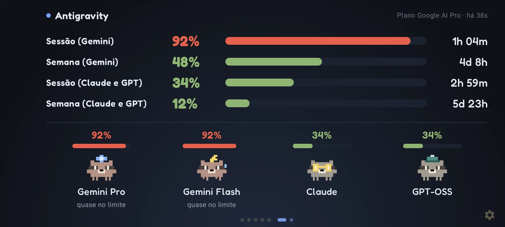

<p>
  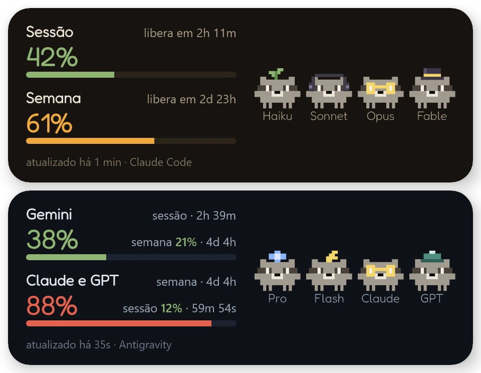
  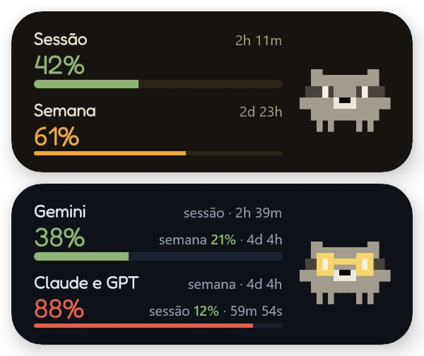
</p>

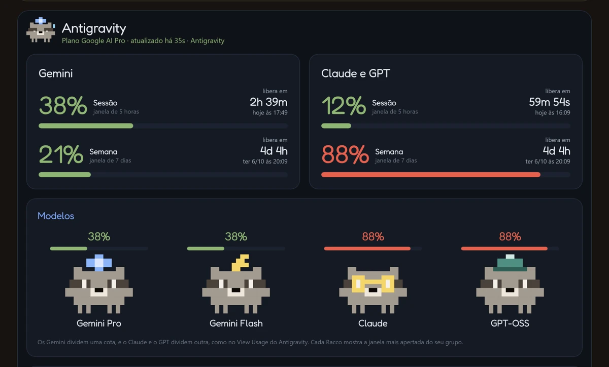

Cada grupo tem a própria linha e a própria hora de liberar, igual ao View Usage. No painel do Windows, cada grupo ganha um
cartão com as duas janelas, e os Raccos mostram a janela mais apertada do grupo deles. No Android, dá para ligar ou desligar
cada ferramenta e escolher o tema em Configurações → Ferramentas.

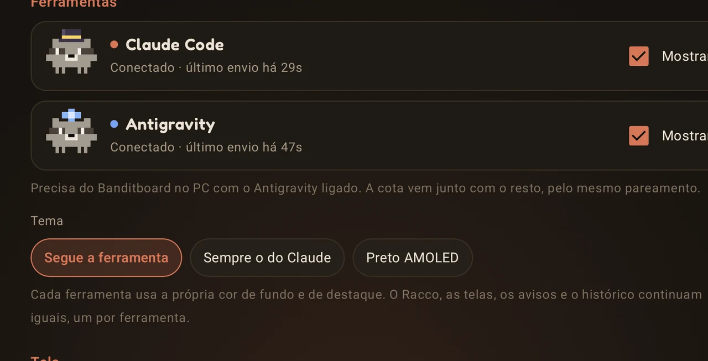

### iPhone

<p>
  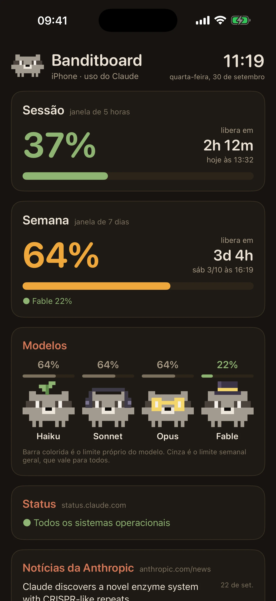
  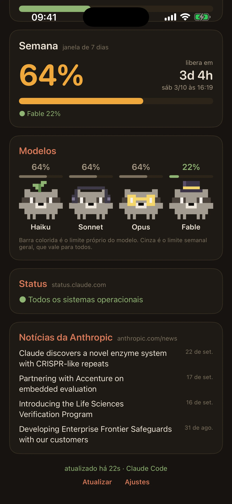
  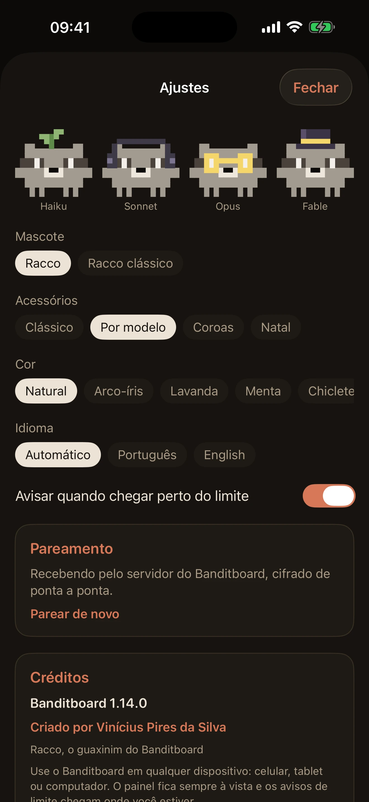
</p>

<p>
  
  
</p>

O painel, os ajustes, os widgets da Tela de Início e os avisos. Os widgets também vêm nos tamanhos da Tela Bloqueada e aparecem
no StandBy. O iOS decide com que frequência os apps atualizam em segundo plano, então no iPhone um aviso pode chegar alguns
minutos depois.

### Apple Watch

<p>
  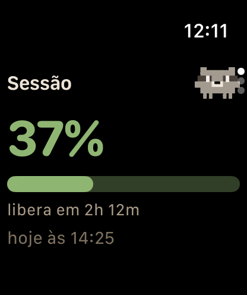
  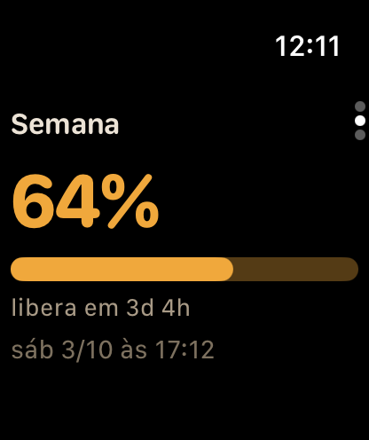
  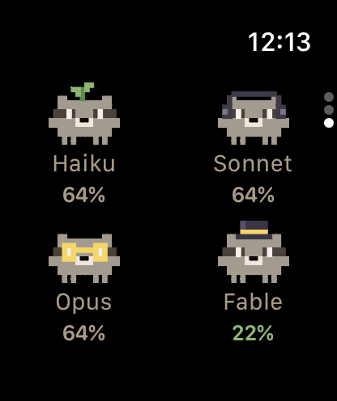
</p>

Gire a Coroa Digital para ir da sessão para a semana e os modelos. As complicações vêm nos formatos redondo, retangular, de
canto e em linha.

### Mac

<p>
  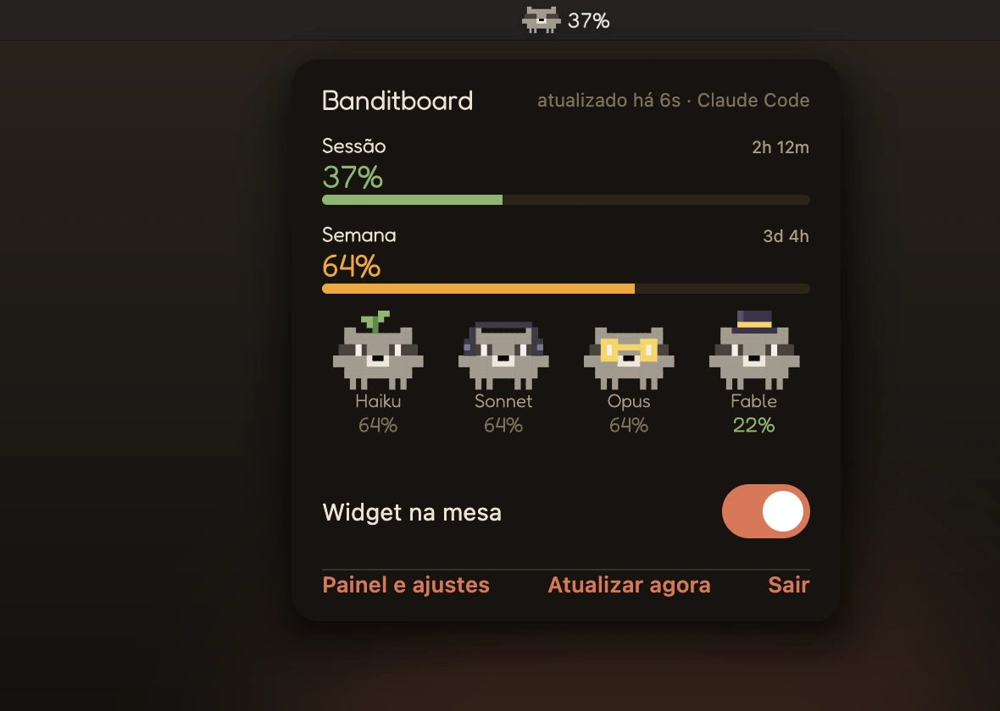
  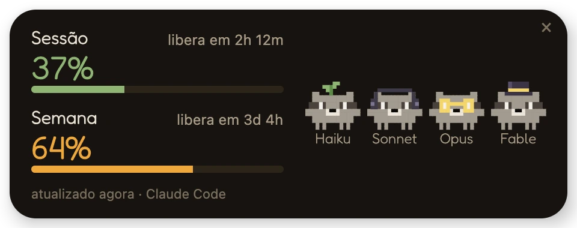
</p>

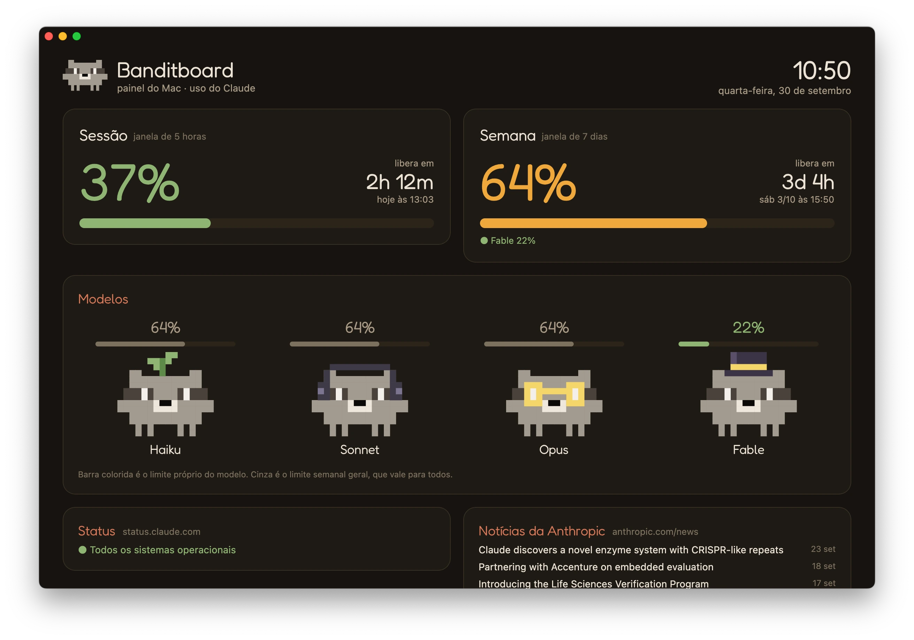

Clique no Racco da barra de menus para abrir o painelzinho. Dali você liga ou desliga o widget na mesa, abre o painel ou
atualiza na hora. O painel tem todos os ajustes, o "Abrir ao iniciar sessão" e o código para parear o iPhone.

### Atividade do Claude

<p>
  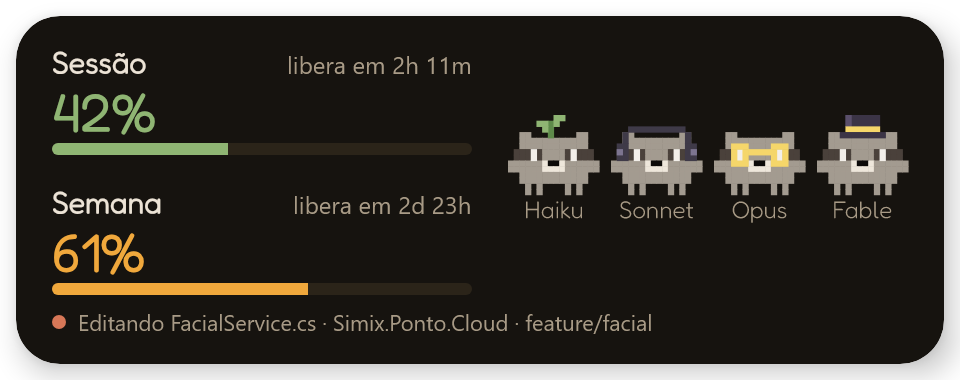
  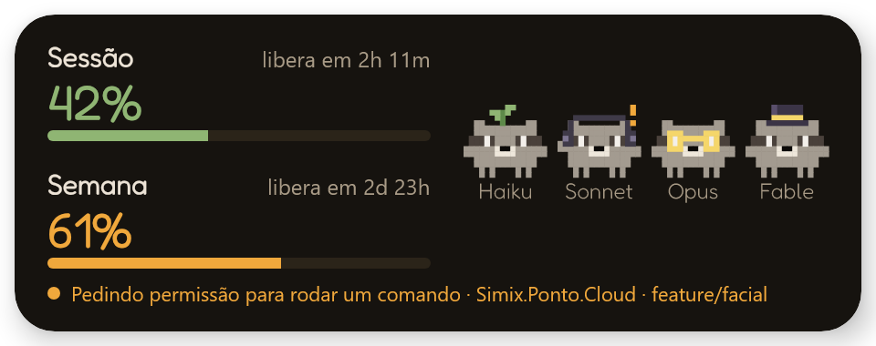
</p>

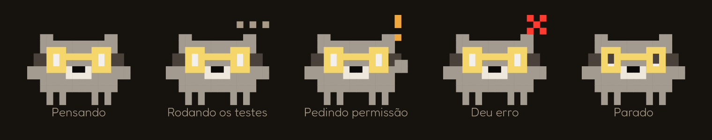

O Racco de cada modelo acompanha a sessão dele: aqui o Opus está editando enquanto o Sonnet espera uma permissão. O widget
compacto e o "Só o Racco" também reagem, e no Mac a barra de menus ganha um "!" laranja quando o Claude precisa de você.

### Widget no Windows

<p>
  
  
  
</p>


O widget tem três formatos, que você troca pelo ícone perto do relógio do Windows: completo, compacto ou só o Racco.
Dê dois cliques em qualquer widget, ou escolha "Painel e ajustes" no ícone, para abrir o painel: são os mesmos cartões do
painel web do celular, mais as configurações do widget e os créditos, com um QR code para baixar o app do celular. Dá para
arrastar o widget para onde quiser, e ele lembra o lugar. Também dá para tirar ele da barra de tarefas e fazer ele abrir junto
com o Windows. Quando toca música no PC, os guaxinins dançam. Se só uma sessão do Claude Code estiver aberta, o "Só o Racco" e
o widget compacto usam o acessório do modelo dela: óculos no Opus, cartola no Fable. Um clique no widget atualiza na hora, e o
Racco dá uma mexidinha. Com o botão direito, aparece o mesmo menu do ícone da bandeja.

### Reações do Racco

| | | |
|---|---|---|
|  |  |  |
| Sessão vazia: dormindo | 88%: suando | 97%: vermelhos e tremendo |
|  |  |  |
| 100%: estourados | Limite do Fable em 100%: só ele estoura | Tocando música: dançando |

Nesses prints o Opus aparece cinza, com olhos em X, porque os dados de exemplo trazem um problema em aberto no
status.claude.com.

### Modo música


## 🛠️ Problemas comuns

- **O Windows diz "O Windows protegeu o computador".** O instalador ainda não tem assinatura digital. Clique em "Mais informações" e depois em "Executar assim mesmo". Se quiser ter certeza de que é o arquivo certo, compare o [SHA-256](#-segurança) com o da versão.
- **O macOS diz que não conseguiu verificar o Banditboard.** O app ainda não tem a notarização da Apple. Vá em Ajustes do Sistema → Privacidade e Segurança e clique em "Abrir Mesmo Assim". Só precisa fazer isso uma vez.
- **O Android não deixa instalar o APK.** Ele vem do GitHub, e não da Play Store, então o Android pede para permitir "instalar apps desconhecidos" no navegador ou no gerenciador de arquivos que abriu o arquivo.
- **O app do iPhone parou de abrir.** Com um Apple ID gratuito, o app instalado por fora da App Store dura 7 dias. Renove no AltStore ou instale o IPA de novo pelo Sideloadly; o pareamento continua.
- **"Configuração restrita" ao ligar o modo música.** No Android 13 ou mais novo, um APK instalado pelo navegador ou por um gerenciador de arquivos não recebe acesso às notificações de cara. Vá em Configurações → Apps → Banditboard → ⋮ → Permitir configurações restritas e tente de novo.
- **O celular parou de atualizar depois que o roteador reiniciou.** No pareamento por PIN, provavelmente o celular mudou de IP. A tela e o rodapé do painel sempre mostram o endereço atual: abra esse endereço no PC e rode o comando de novo. Para não ter esse problema, reserve um IP fixo para o celular no roteador, ou conecte de qualquer lugar pelo site.
- **O Windows não consegue conectar o Claude Code.** O widget mostra o motivo, e o "O que fazer" abre o painel com o próximo passo e o erro exato do PowerShell. Os detalhes ficam em `%APPDATA%\Banditboard\conectar.log` (sem a chave de pareamento), e dá para mandar esse arquivo numa [issue](../../issues).
- **A atividade do Claude não aparece.** O Claude Code carrega os hooks quando a sessão começa, então abra uma sessão nova depois de ligar. O app do Windows ou do Mac precisa estar aberto, porque é ele que recebe os eventos.
- **Os números não mudam.** O hook roda depois das respostas do Claude Code, no máximo a cada 2 minutos, e o Antigravity é lido a cada 15 segundos. Para buscar na hora, clique no widget, ou use "Atualizar agora" no painel do Windows ou do Mac, no menu da bandeja ou no painelzinho da barra do Mac.
- **O Antigravity aparece como "Sem acesso".** Provavelmente o Antigravity está aberto como administrador. Feche e abra de novo do jeito normal, ou abra o Banditboard como administrador. Em Ferramentas → "Exportar diagnóstico do Antigravity", o Banditboard salva um arquivo de texto em Downloads, sem token, senha nem e-mail, que dá para mandar numa [issue](../../issues).

## 🧭 Próximos passos

- [Linux: uma versão do hook em shell](../../issues/1)
- O Antigravity no Mac, no iPhone e no Apple Watch
- iPhone e Apple Watch no TestFlight e na App Store, com avisos por push
- App para Wear OS, no Galaxy Watch e nos outros relógios com Android
- [Android 16: passar para a API 36](../../issues/4)

## 📚 Documentação

- [Como funciona](docs/como-funciona.md): o caminho dos dados, cada configuração e de onde vêm os números
- [Desenvolvimento](docs/desenvolvimento.md): como compilar, testar, diagnosticar pelo ADB e como o código está organizado
- [Como contribuir](CONTRIBUTING.md)

## 🤝 Quer ajudar?

Issues e pull requests são bem-vindos. Para mudanças maiores, abra uma issue antes para a gente conversar. O
[CONTRIBUTING.md](CONTRIBUTING.md) explica como o projeto está organizado e onde ficam as explicações.

Dúvidas e ideias vão para as [Discussions](../../discussions); problemas, para as [Issues](../../issues).

## 📄 Licença e aviso

Licenciado sob a [licença MIT](LICENSE). A fonte Fredoka é distribuída pela SIL Open Font License, e o texto da licença vai
dentro do APK, em `assets/licenses/`.

O Banditboard é um projeto pessoal de fã, **sem vínculo, apoio ou patrocínio da Anthropic ou do Google**. Claude e Claude Code
são marcas da Anthropic, PBC. Google Antigravity, Gemini e Android são marcas do Google LLC; iPhone, Apple Watch, macOS e StandBy são marcas da Apple Inc.; Windows é marca da
Microsoft Corporation.

Feito com ❤️ por [Vinícius Pires da Silva](https://www.linkedin.com/in/viniciuspiresdasilva/).

**Gostou? Deixe uma ⭐**
