# 🦝 Banditboard

<p align="right"><a href="README.md">English</a> · <b>Português</b></p>

**Use aquele celular Android parado, ou só o seu PC com Windows, para acompanhar o uso do Claude Code.**

<p align="center">
  
</p>

<details>
<summary><b>▶️ Veja em vídeo (31 s)</b></summary>

https://github.com/user-attachments/assets/be7d9ca2-20fa-4d44-8a3b-9ddea6b213d0

</details>

<p align="center">
  <a href="../../releases/latest"></a>
  <a href="../../releases"></a>
  <a href="LICENSE"></a>
  <a href="../../commits/main"></a>
  
  
  <a href="../../stargazers"></a>
</p>

<p align="center"><b><a href="#-para-começar">Para começar</a></b> · <a href="https://banditboard.pages.dev/">Site</a> · <a href="../../releases">Todas as versões</a></p>

## O que é o Banditboard?

É um painel que fica ligado na sua mesa mostrando o seu uso do Claude. Foi pensado para aquele celular antigo esquecido
na gaveta. Ele mostra quanto você já gastou da sessão de 5 horas e da semana, quando cada uma libera e se algum modelo está
com problema. Cada modelo é o Racco, um guaxinim em pixel art que dorme, sua, estoura quando chega em 100% e dança quando
toca música.

Não tem um celular sobrando? No Windows, o Banditboard vira um widget pequeno, sempre à vista, que funciona sozinho. E dá
para usar os dois juntos: o mesmo hook manda o uso para o celular e para o PC.

### Por que o Banditboard?

A gente só confere o limite quando lembra de rodar o `/usage`, e a sessão costuma acabar bem no meio da tarefa. O
Banditboard deixa os números sempre à vista, no celular do lado do monitor ou num widget no canto da tela, e avisa quando
chega em 80%, 90% e 100%. Não precisa deixar terminal aberto nem ficar atualizando aba. Os números vêm do próprio Claude Code,
então você não entrega token nem login para ninguém.

## ✨ O que ele faz

- 📊 **Uso num piscar de olhos**: sessão de 5 horas e semana, com contagem regressiva e a hora em que cada uma libera
- 🦝 **Racco, o guaxinim**: um para cada modelo (Haiku, Sonnet, Opus e Fable). Eles piscam, acenam, dormem quando a sessão está vazia, começam a suar em 85%, ficam vermelhos em 90% e estouram em 100%. Quem preferir o Racco clássico, mais detalhado, escolhe nas configurações
- 🔔 **Avisos de limite**: notificação quando a sessão ou a semana chegam em 80%, 90% e 100%, e outra quando liberam, mesmo com o app fechado
- 🪟 **Widget no Windows**: completo, compacto ou só o Racco no canto da tela, sempre por cima das janelas, com avisos do próprio Windows
- 🔌 **Sem token no celular**: os números vêm do `/usage` do próprio Claude Code, no seu PC, pela rede de casa
- 🎵 **Modo música**: mostra o que está tocando no celular (Spotify, YouTube Music ou qualquer outro), com capa, controles e volume, e os guaxinins dançam em todas as telas
- 📈 **Histórico de 7 dias**: uma medição a cada 30 minutos
- 🖥️ **Painel web**: a mesma tela no navegador do PC, dentro da sua rede, protegida por PIN
- 🚦 **Status e notícias**: problemas em aberto no status.claude.com e as últimas notícias da Anthropic
- 🌙 **Preto AMOLED**: e a tela se mexe alguns pixels por minuto para não marcar
- 🌍 **Português e inglês**: segue o idioma do celular, ou você escolhe
- 📱 **Em pé ou deitado**: um layout para cada, e zoom de 90% a 150%

## 🚀 Para começar

| Onde | Arquivo | |
|---|---|---|
| Android 8.0 ou mais novo | `Banditboard-<versão>.apk` | [Baixar](../../releases/latest) |
| Windows 10 ou mais novo, instalador | `Banditboard-<versão>.msi` | [Baixar](../../releases/latest) |
| Windows 10 ou mais novo, portátil | `Banditboard-<versão>-windows.zip` | [Baixar](../../releases/latest) |

**No celular:**

1. Baixe o APK e instale. O Android vai pedir para permitir "instalar apps desconhecidos" no app que abriu o arquivo.
2. No PC, abra o endereço que aparece no celular e crie um PIN.
3. No cartão "Claude Code no seu PC", clique em "Copiar" e cole o comando no PowerShell.
4. Use o Claude Code normalmente, no VS Code ou no terminal. A cada resposta, o celular atualiza.

**Só no Windows, sem celular:**

1. Instale o MSI. Não precisa ser administrador. Se preferir não instalar nada, descompacte o ZIP onde quiser e abra o `Banditboard.exe`.
2. Clique em "Conectar Claude Code" no widget. O uso já aparece em seguida. Se não der para conectar, o widget diz o motivo e o "O que fazer" abre o painel com o próximo passo.
3. Use o Claude Code normalmente. A cada resposta, o widget atualiza. Para buscar na hora, use "Atualizar agora" no painel ou no menu da bandeja.

Vai usar os dois? Conecte cada um uma vez. O hook guarda a lista de destinos em `~/.claude/clawdboard-targets.json` e
manda o uso para todos. Se o celular já estava conectado, não precisa mexer nele: ao conectar o Windows, o celular entra
na lista sozinho.

> Depois das respostas, um hook do Claude Code roda o `/usage`, no máximo a cada 2 minutos, e isso não gasta tokens.
> O uso do claude.ai e de outros aparelhos também entra na conta, porque o `/usage` mostra o plano inteiro. Por enquanto,
> o script do PC só funciona no Windows ([macOS e Linux estão a caminho](../../issues/1)).

## 🔐 Segurança

- O celular não guarda token do Claude e nunca fala com a API da Anthropic. Quem lê os limites é o próprio Claude Code, no seu PC, com o `/usage`, e um script pequeno só repassa os números. O script não mexe nas credenciais do Claude Code.
- O script manda apenas as porcentagens, a hora em que cada limite libera e qual modelo cada sessão ativa está usando ("opus", "sonnet"...). Nada das suas conversas, dos seus arquivos ou dos IDs das sessões.
- Cada envio leva uma chave de pareamento de 128 bits. O celular compara com um hash SHA-256, e "Criar chave nova" invalida o comando antigo na hora.
- A chave de pareamento fica criptografada com AES-256-GCM, com uma chave tirada do seu PIN (PBKDF2, 150.000 iterações) e protegida pelo Android Keystore. O PIN não fica salvo em lugar nenhum.
- Errou o PIN 10 vezes seguidas? A chave de pareamento, o histórico e as configurações são apagados.
- O painel web só funciona dentro da sua rede, pede o mesmo PIN e só responde quando o endereço é um IP, `localhost` ou um nome `.local`, o que impede ataques de DNS rebinding. Entrar no painel também desbloqueia a tela do celular.
- O instalador faz um backup das configurações do Claude Code em `settings.json.antes-do-clawdboard`, adiciona dois hooks (`Stop` e `SessionStart`) e não mexe na sua status line.
- O app do Windows só atende em `127.0.0.1`, então ninguém da sua rede consegue acessar ele, e mesmo assim ele confere a chave de pareamento a cada envio.
- O modo música precisa de acesso às notificações porque é só assim que o Android mostra o player que está tocando. O Banditboard usa isso para ver e controlar o player; ele não lê as suas notificações.

**Leia os scripts antes de rodar.** Tudo o que roda no seu PC é PowerShell curto, dá para conferir linha por linha:
o [`install.ps1`](app/src/main/assets/pc/install.ps1) (grava o hook e mexe no `settings.json`),
o [`usage.ps1`](app/src/main/assets/pc/usage.ps1) (o hook em si) e
o [`connect.ps1`](desktop/src/main/resources/connect.ps1) (o que o app do Windows usa para rodar o instalador).

**Confira o download.** Cada versão traz o SHA-256 do APK, do MSI e do ZIP. Compare com o do arquivo que você baixou:

```powershell
Get-FileHash .\Banditboard-1.13.2.msi -Algorithm SHA256
```

## 📱 Como ele é

### Telas principais

| | | |
|---|---|---|
| 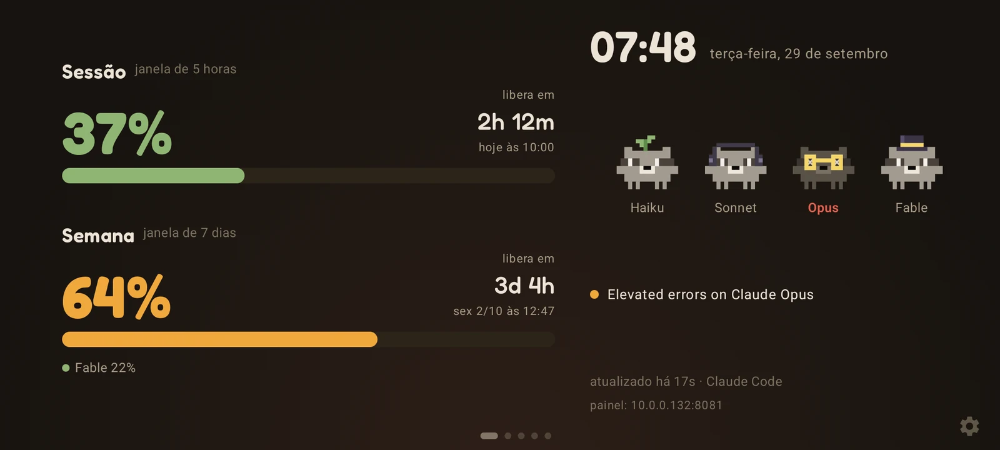 | 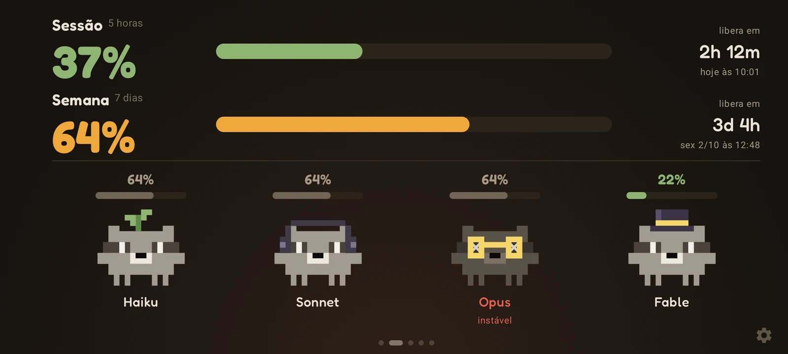 |  |
| Painel | Mascotes | Histórico de 7 dias |

<p>
  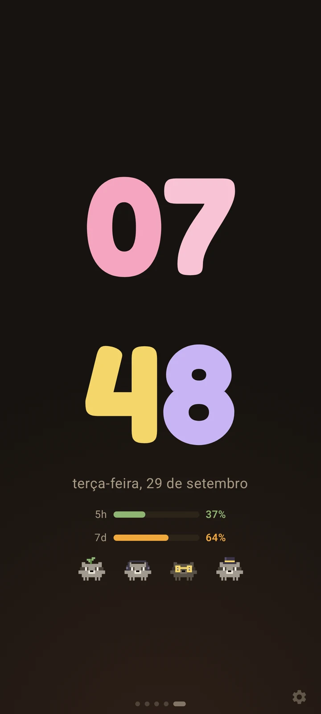
  
</p>

O relógio de mesa com o celular em pé e os avisos de limite (esse print está em inglês). Para os avisos chegarem com o app
fechado, o celular deixa uma notificação discreta enquanto espera o PC. Se não quiser os avisos, desligue em
Configurações → Tela.

### Widget no Windows

<p>
  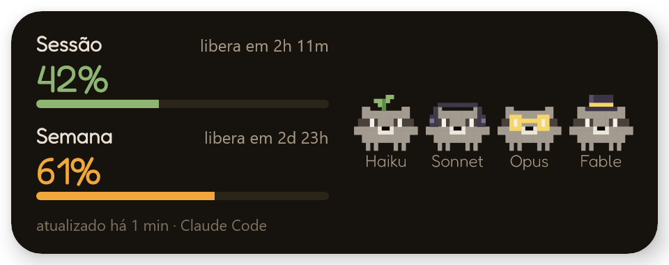
  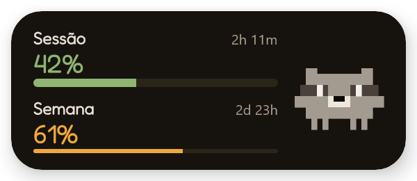
  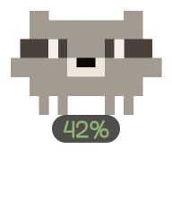
</p>

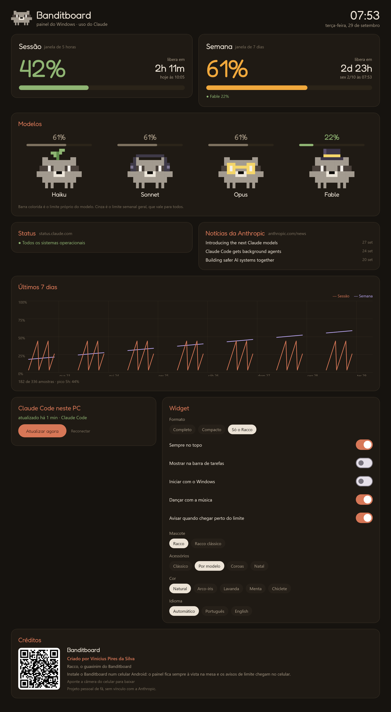

O widget tem três formatos, que você troca pelo ícone perto do relógio do Windows: completo, compacto ou só o Racco.
Dê dois cliques em qualquer widget, ou escolha "Abrir painel" no ícone, para abrir o painel: são os mesmos cartões do painel
web do celular, mais as configurações do widget e os créditos, com um QR code para baixar o app do celular. Dá para arrastar
o widget para onde quiser, e ele lembra o lugar. Também dá para tirar ele da barra de tarefas e fazer ele abrir junto com o
Windows. Quando toca música no PC, os guaxinins dançam. Se só uma sessão do Claude Code estiver aberta, o "Só o Racco" e o
widget compacto usam o acessório do modelo dela: óculos no Opus, cartola no Fable.

### Reações do Racco

| | | |
|---|---|---|
| 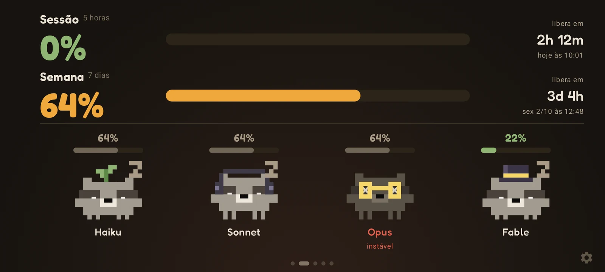 | 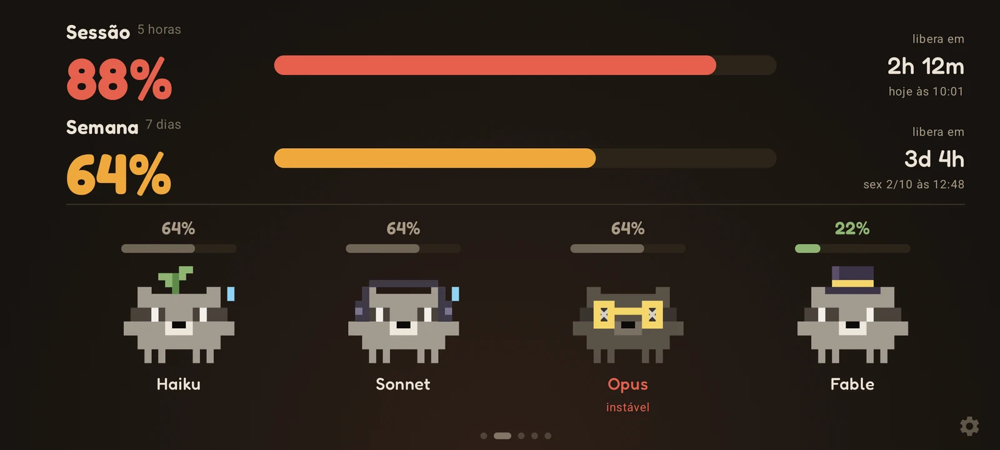 | 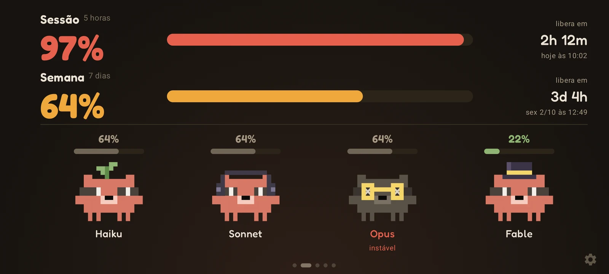 |
| Sessão vazia: dormindo | 88%: suando | 97%: vermelhos e tremendo |
| 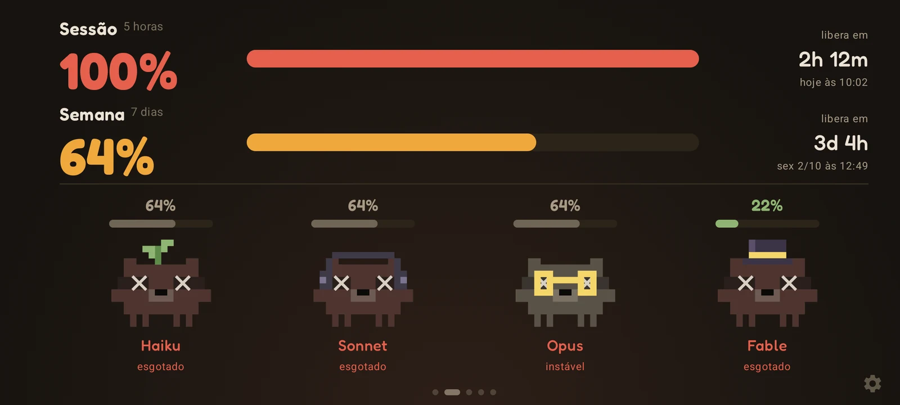 | 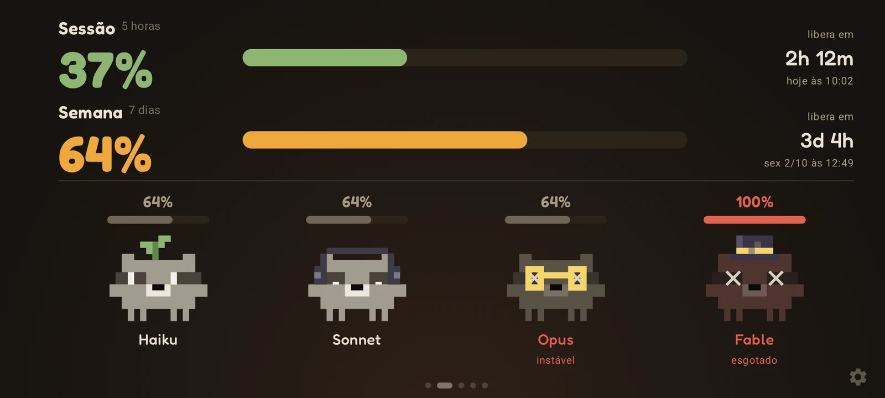 |  |
| 100%: estourados | Limite do Fable em 100%: só ele estoura | Tocando música: dançando |

Nesses prints o Opus aparece cinza, com olhos em X, porque os dados de exemplo trazem um problema em aberto no
status.claude.com.

### Modo música

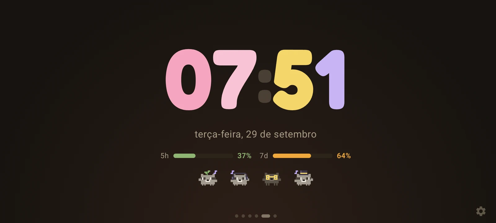

## 🛠️ Problemas comuns

- **O Windows diz "O Windows protegeu o computador".** O instalador ainda não tem assinatura digital. Clique em "Mais informações" e depois em "Executar assim mesmo". Se quiser ter certeza de que é o arquivo certo, compare o [SHA-256](#-segurança) com o da versão.
- **O Android não deixa instalar o APK.** Ele vem do GitHub, e não da Play Store, então o Android pede para permitir "instalar apps desconhecidos" no navegador ou no gerenciador de arquivos que abriu o arquivo.
- **"Configuração restrita" ao ligar o modo música.** No Android 13 ou mais novo, um APK instalado pelo navegador ou por um gerenciador de arquivos não recebe acesso às notificações de cara. Vá em Configurações → Apps → Banditboard → ⋮ → Permitir configurações restritas e tente de novo.
- **O celular parou de atualizar depois que o roteador reiniciou.** Provavelmente o celular mudou de IP. A tela e o rodapé do painel sempre mostram o endereço atual: abra esse endereço no PC e rode o comando de novo. Para não ter esse problema, reserve um IP fixo para o celular no roteador.
- **O Windows não consegue conectar o Claude Code.** O widget mostra o motivo, e o "O que fazer" abre o painel com o próximo passo e o erro exato do PowerShell. Os detalhes ficam em `%APPDATA%\Banditboard\conectar.log` (sem a chave de pareamento), e dá para mandar esse arquivo numa [issue](../../issues).
- **Os números não mudam.** O hook roda depois das respostas do Claude Code, no máximo a cada 2 minutos. Para buscar na hora, use "Atualizar agora" no painel do Windows ou no menu da bandeja.

## 🧭 Próximos passos

- [macOS e Linux: uma versão do hook em shell](../../issues/1)
- [App para iPhone com widget na tela inicial e no StandBy](../../issues/2)
- [App para Mac com widget na área de trabalho](../../issues/3)
- [Android 16: passar para a API 36](../../issues/4)

## 📚 Documentação

- [Como funciona](docs/como-funciona.md): o caminho dos dados, cada configuração e de onde vêm os números
- [Desenvolvimento](docs/desenvolvimento.md): como compilar, testar, diagnosticar pelo ADB e como o código está organizado
- [Como contribuir](CONTRIBUTING.md)

## 🤝 Quer ajudar?

Issues e pull requests são bem-vindos. Para mudanças maiores, abra uma issue antes para a gente conversar. O
[CONTRIBUTING.md](CONTRIBUTING.md) explica como o projeto está organizado e onde ficam as explicações.

Dúvidas e ideias vão para as [Discussions](../../discussions); problemas, para as [Issues](../../issues).

## 📄 Licença e aviso

Licenciado sob a [licença MIT](LICENSE). A fonte Fredoka é distribuída pela SIL Open Font License, e o texto da licença vai
dentro do APK, em `assets/licenses/`.

O Banditboard é um projeto pessoal de fã, **sem vínculo, apoio ou patrocínio da Anthropic**. Claude e Claude Code são marcas da
Anthropic, PBC.

Feito com ❤️ por [Vinícius Pires da Silva](https://www.linkedin.com/in/viniciuspiresdasilva/).

**Gostou? Deixe uma ⭐**
